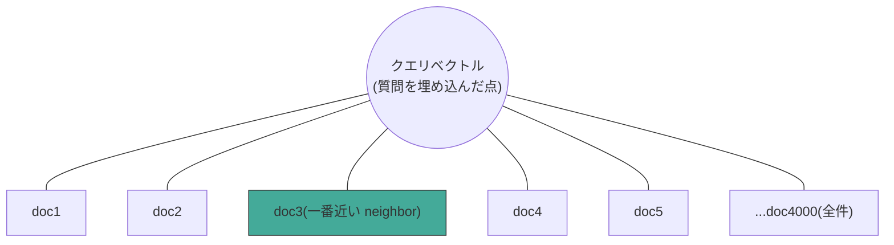
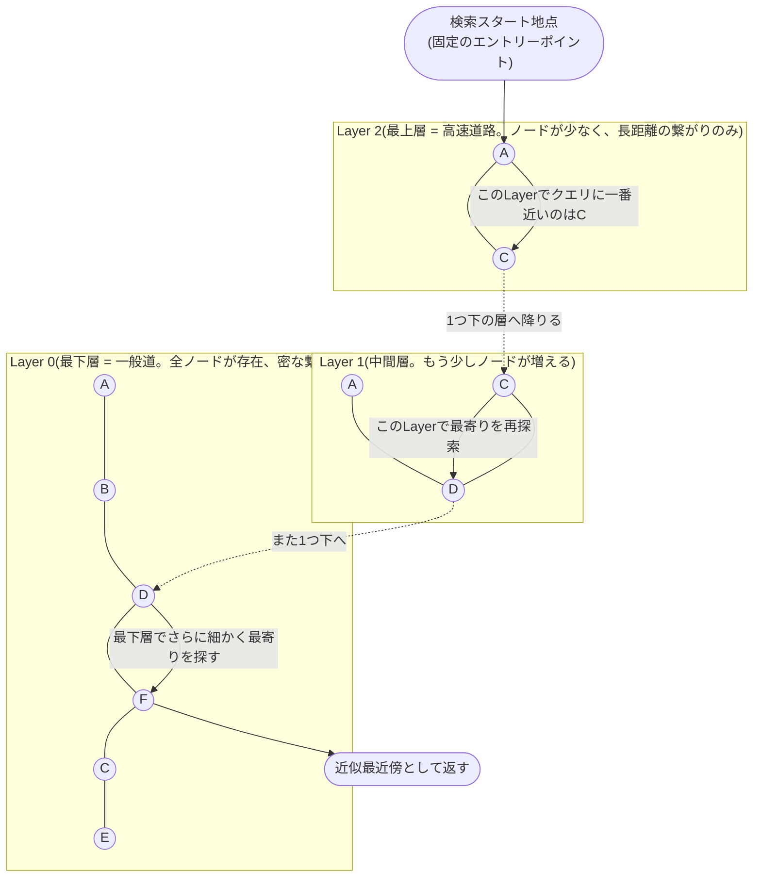
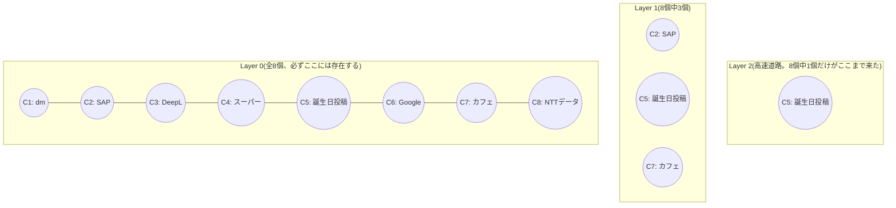
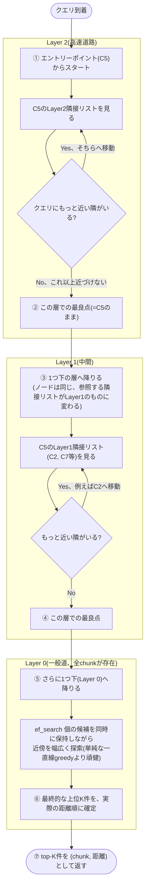
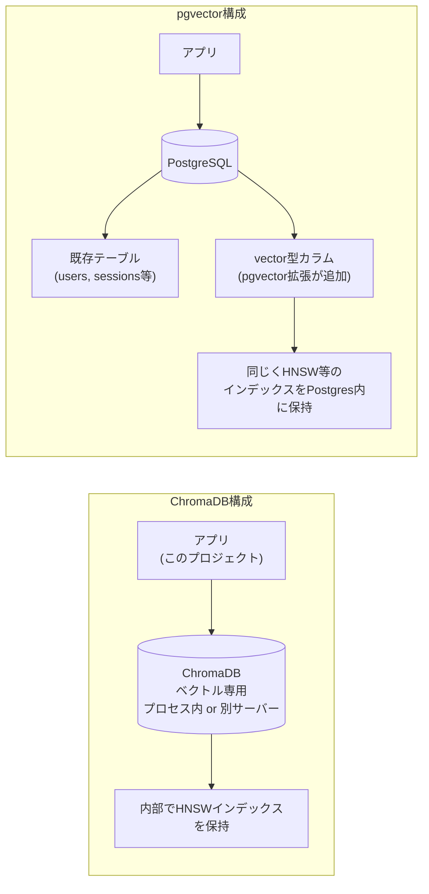
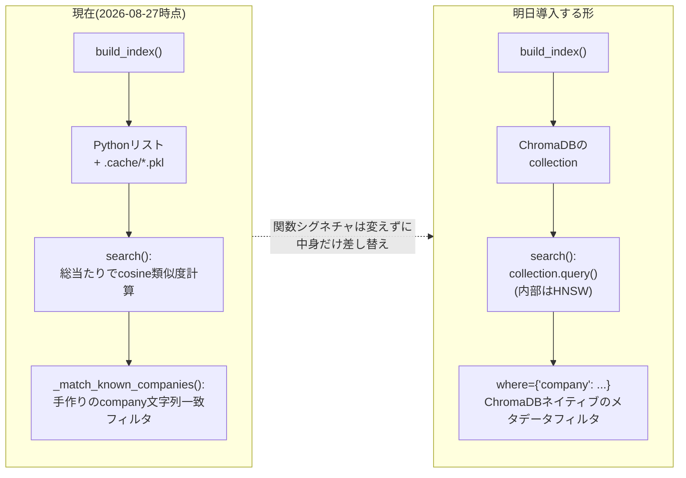

# ANN(Approximate Nearest Neighbor)・HNSW・ChromaDB/pgvectorの構造

> 明日(2026-08-28)のChromaDB導入の前に見返す用。「ANNはArtificial Neural Networkではない」「Neighborと言われてもピンと来ない」への図解。
> 関連: [when-vector-db-becomes-necessary.md](when-vector-db-becomes-necessary.md)

---

## 0. まず「Neighbor(近傍)」という言葉の感覚をつかむ

BGE-M3で埋め込んだ各chunkは、1024次元空間の中の**1つの点**。「意味が近い文章 = 空間の中で近くにある点」という前提がRAGの土台(これ自体は既に何週間も前提にしている)。

**Nearest Neighbor検索 = 「クエリという点から見て、一番近くにある点(たち)を探す」**、それだけ。現実の「近所さん(neighbor)」と同じ言葉を使っているのは、比喩ではなく文字通り「空間的に近い」という意味だから。

上の図が**素朴な総当たり(ブルートフォース)検索**。クエリが**全ドキュメントと1個ずつ距離を測っている**、これが今`src/similarity.py`でやっていること。4,000件なら一瞬だが、これが数百万件になると「全員に声をかけて回る」ようなもので、遅くなる。

## 1. HNSWは「全員に聞く」代わりに「知り合いを辿る」

HNSW = **H**ierarchical **N**avigable **S**mall **W**orld。3つの単語がそれぞれ役割を持つ。

- **Hierarchical(階層的)**: 上の層ほどノードが少なく「高速道路」的な長距離ジャンプができる。下の層に行くほどノードが増え「一般道」的に密になる
- **Navigable(たどれる)**: 今いるノードから「クエリに一番近い隣のノードへ」を繰り返すだけ(greedy)で、迷わず目的地に近づける
- **Small World(スモールワールド)**: 少ないホップ数でどのノードにも辿り着けるグラフの性質(六次の隔たりと同じ発想)。この性質のおかげでgreedyな移動が機能する

**流れ**: 上の層(高速道路)で大まかな方向に飛ぶ → 1つ下の層に降りる → その層でまた最寄りへ移動 → さらに下へ…という「大まかに絞ってから細かく絞る」の繰り返し。全件と比較する必要がないので、数百万件でも高速。「近似的」なのは、greedyな移動が本当の最近傍を見逃す可能性があるから(それでも実用上十分な精度が出ることが多い)。

## 1-2. 層はどう決まるか、実際に手を動かして確認する

「恣意的でも、検索のたびに変わるものでもなく、データを追加する瞬間に1回だけ、確率のくじ引きで自動的に決まる」と説明したが、言葉だけだとピンと来ないので、実際に8個のchunkでシミュレーションしてみる。

### 前提: 1024次元は見せられないので、コイントスで代用する

本物のHNSWは`level = floor(-ln(乱数) × mL)`という対数の式を使うが、これは**「表が出続ける限り上の階へ進める、裏が出たら止まる」というコイントスと本質的に同じ**(どちらも「上に行くほど指数関数的に確率が下がる」という同じ性質を作るための道具)。まずはコイントスで直感を作り、後で本物の式にも触れる。

### やってみる: このプロジェクトの実際のchunk 8個で

`build_index()`が扱っているchunkの種類(レシート、LinkedIn Connections、LinkedIn Shares)から8個選び、それぞれ独立にコイントスする(**1個のchunkにつき1回、そのchunkがインデックスに追加される瞬間だけ**):

| chunk | コイントスの結果 | 参加する層 |
|---|---|---|
| C1: レシート(dm-drogerie markt) | 裏 | Layer 0 のみ |
| C2: LinkedIn Connection(SAP) | 表→裏 | Layer 0, 1 |
| C3: LinkedIn Connection(DeepL) | 裏 | Layer 0 のみ |
| C4: レシート(スーパー) | 裏 | Layer 0 のみ |
| C5: LinkedIn Shares(誕生日の投稿) | 表→表→裏 | Layer 0, 1, 2 |
| C6: LinkedIn Connection(Google) | 裏 | Layer 0 のみ |
| C7: レシート(カフェ) | 表→裏 | Layer 0, 1 |
| C8: LinkedIn Connection(NTTデータ) | 裏 | Layer 0 のみ |

**この8回のコイントスの結果、自然にできあがる階層**:

**ここで分かること**: C5(たまたま3回コイントスに勝った)が高速道路に乗ったのは、「投稿の内容が重要だから」でも「意味的に中心にあるから」でもなく、**純粋にコイントスの結果がそうだったから**。C1やC3やC4やC6やC8のようなレシート・Connectionのchunkが高速道路に乗らなかったのも、同じく偶然。**中身(意味・重要度)は層の決定に一切関与しない**。もし同じデータでインデックスを作り直したら、次は別のchunkが高速道路に乗るかもしれない(乱数なので)。

### 本物の式(参考、試験対策用)

実際のHNSWは`level = floor(-ln(U) × mL)`(Uは0〜1の一様乱数、mLは`1/ln(M)`という定数、Mは接続数を決めるパラメータで典型的には16)。

| 乱数 U | 計算 | 結果level |
|---|---|---|
| 0.83 | floor(-ln(0.83) × 0.36) = floor(0.186 × 0.36) | 0 |
| 0.40 | floor(-ln(0.40) × 0.36) = floor(0.916 × 0.36) | 0 |
| 0.05 | floor(-ln(0.05) × 0.36) = floor(2.996 × 0.36) | 1 |
| 0.003 | floor(-ln(0.003) × 0.36) = floor(5.809 × 0.36) | 2 |

小さい乱数を引くほど(確率的に稀)、高い層まで到達する。コイントスの例と同じ「稀な当たりを引いたものだけが上の層に行く」という構造。

### 質問への直接の回答

- **恣意的に選ぶ? 自動的に決まる?** → 完全に自動。人間もアルゴリズムも「これを重要だから選ぼう」とは判断しない、純粋な乱数
- **検索のたびに変わる?** → 変わらない。**chunkがインデックスに追加される瞬間に1回だけ**くじを引き、それ以降は固定される。検索(クエリ)はこの固定された構造の上を移動するだけで、構造そのものには一切手を加えない
- **チャンクレベルの話?** → その通り。**1個のchunk(=1個のDocumentから作られた1024次元ベクトル)につき、独立に1回**くじを引く。あるchunkの結果が別のchunkの結果に影響することはない

## 1-3. ランダムな層決定と「意味的に正しい検索」は矛盾しないのか

**疑問**: 層への割り当てが完全にランダムで意味と無関係なら、欲しいchunkがたまたまLayer 0にしかいなかった場合、検索から漏れてしまうのでは?

**答え: 漏れない。理由は2つ。**

**1. Layer 0には、コイントスの結果に関わらず必ず全chunkが存在する。** 高速道路に乗れなかったchunkも、Layer 0では全員平等に存在している。誰も検索対象から除外されない。

**2. ランダムなのはグラフの"骨格"(近道の場所)だけ。「どれが近いか」の判定は毎回、本物の計算。** 検索中に「今いるノードの隣接候補の中で、クエリに一番近いのはどれか」を判定する部分は、**毎回、実際の埋め込みベクトル同士のコサイン類似度を計算**している。意味が近いchunk同士が実際に近い、という埋め込みの性質(Day 3-4のPCA可視化で確認済み)は、この判定でちゃんと使われている。骨格はくじ引き、移動の判断は毎回本物の計算、という役割分担。

**では「近似的」の正体は何か**: 上の層から降りてきた「探索の出発点」が、本当に一番近いchunkから遠い場所だと、greedyな移動が「これ以上近づけない場所(局所最適)」で止まってしまうことがある。本当はもっと近いchunkが少し離れた場所にあるのに、直接繋がっていないので気づけない、というのが本当のリスクの所在。「chunkが高速道路に乗れなかったから見逃す」わけではない。このリスクは`ef_search`(探索中に同時に検討する候補の数)を増やすことで下げられる(多いほど正確・遅い、少ないほど速い・不正確というトレードオフ)。

**2つの補足訂正**:
- 層の分布は正規分布(釣鐘型)ではなく**幾何分布(指数的減衰)**。「1層目が一番多く、上に行くほど急激に減る」という片側だけの減衰
- 「ランダムにすることでブルートフォースじゃなくなる」というより、正確には**階層構造(疎な近道)があることがブルートフォースじゃなくなる理由**。ランダムはその階層構造を安く自動生成するための手段、という位置づけ

## 1-4. クエリがLayer 2から0へ降りていく道のり(図解)

各層で「ノードは変わらないが、参照する隣接リストだけ切り替わる」(③⑤の矢印)という点がポイント。上の層でだいたいの方向を絞り、下に降りるほど選択肢が増えて精度が上がっていく。

## 1-5. 「似ていた」という情報の正体

**静的に保存されているもの**: 誰と誰が繋がっているか(層ごとの隣接リスト、グラフの骨格)。これはインデックス構築時に決まり、ディスクに永続化される。
**クエリのたびに動的に計算されるもの**: 誰が実際にクエリに近いか(上の図の①〜⑦の道のり、最終的な距離)。事前に用意されているスコアではなく、検索のたびにその場で計算される。

骨格は先に作っておき、実際の「近さ」の判定はいつも検索時に本物の計算をする、という点は今のブルートフォース検索とも共通(違うのは「全員と比較するか、道筋をたどって一部とだけ比較するか」)。

## 2. ChromaDB vs pgvector: 構造の違い

**同じ点**: どちらも内部でHNSW相当のANNインデックスを使い、「近似最近傍検索」という核の機能は同じ。

**違う点**: ChromaDBは**ベクトル検索専用に切り出されたシステム**。pgvectorは**PostgreSQLという汎用DBに追加された拡張機能**で、既存のテーブル(構造化データ)と同じDBの中でベクトル検索も行える。「どちらが優れているか」ではなく、「単体のツールを1つ足すか、既に使っているDBに機能を足すか」という構成の違い。

## 3. 明日、このプロジェクトで何が変わるか

**やることの本質**: `build_index()`と`search()`という「入口」は変えず、中身の実装だけを「Pythonリストの総当たり」から「ChromaDBのHNSWインデックス」に差し替える。今日手作りした`_match_known_companies`は、ChromaDBの`where`フィルタに置き換えて比較する。これが今日話した「後から差し替えやすい設計にしていたから、今この移行が低コストでできる」の実地確認になる。

---

## まとめ(1文ずつ)

- **Nearest Neighbor** = 埋め込み空間の中で「クエリに近い点」を探すこと、文字通りの意味
- **ANN(この文脈)** = Approximate Nearest Neighbor、近似的に高速でNearest Neighborを探すアルゴリズム。Artificial Neural Networkとは別物
- **HNSW** = 階層構造(高速道路→一般道)を使って、全件比較せずgreedyに近傍へたどり着く具体的なANN手法
- **ChromaDB** = HNSW等を内部で使う、ベクトル検索専用のスタンドアロンなシステム
- **pgvector** = 同じくHNSW等を使うが、PostgreSQLの拡張として既存の構造化データと同居する
