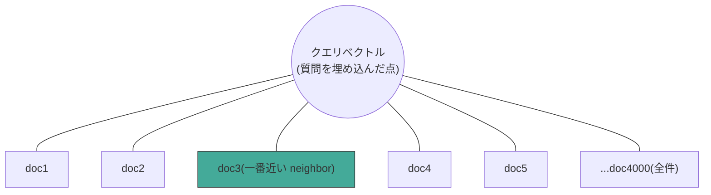
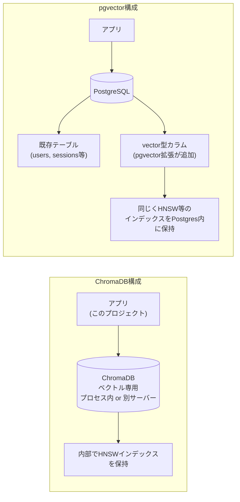
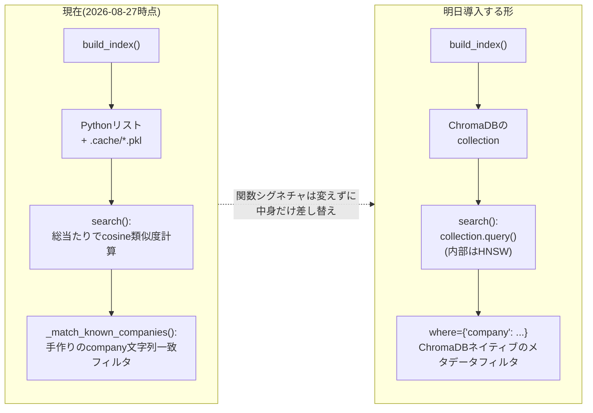

# ANN(Approximate Nearest Neighbor)・HNSW・ChromaDB/pgvectorの構造

> 明日(2026-08-28)のChromaDB導入の前に見返す用。「ANNはArtificial Neural Networkではない」「Neighborと言われてもピンと来ない」への図解。
> 関連: [when-vector-db-becomes-necessary.md](when-vector-db-becomes-necessary.md)

---

## 0. まず「Neighbor(近傍)」という言葉の感覚をつかむ

BGE-M3で埋め込んだ各chunkは、1024次元空間の中の**1つの点**。「意味が近い文章 = 空間の中で近くにある点」という前提がRAGの土台(これ自体は既に何週間も前提にしている)。

**Nearest Neighbor検索 = 「クエリという点から見て、一番近くにある点(たち)を探す」**、それだけ。現実の「近所さん(neighbor)」と同じ言葉を使っているのは、比喩ではなく文字通り「空間的に近い」という意味だから。

上の図が**素朴な総当たり(ブルートフォース)検索**。クエリが**全ドキュメントと1個ずつ距離を測っている**、これが今`src/similarity.py`でやっていること。4,000件なら一瞬だが、これが数百万件になると「全員に声をかけて回る」ようなもので、遅くなる。

## 1. HNSWは「全員に聞く」代わりに「知り合いを辿る」

HNSW = **H**ierarchical **N**avigable **S**mall **W**orld。3つの単語がそれぞれ役割を持つ。

- **Hierarchical(階層的)**: 上の層ほどノードが少なく「高速道路」的な長距離ジャンプができる。下の層に行くほどノードが増え「一般道」的に密になる
- **Navigable(たどれる)**: 今いるノードから「クエリに一番近い隣のノードへ」を繰り返すだけ(greedy)で、迷わず目的地に近づける
- **Small World(スモールワールド)**: 少ないホップ数でどのノードにも辿り着けるグラフの性質(六次の隔たりと同じ発想)。この性質のおかげでgreedyな移動が機能する

**流れ**: 上の層(高速道路)で大まかな方向に飛ぶ → 1つ下の層に降りる → その層でまた最寄りへ移動 → さらに下へ…という「大まかに絞ってから細かく絞る」の繰り返し。全件と比較する必要がないので、数百万件でも高速。「近似的」なのは、greedyな移動が本当の最近傍を見逃す可能性があるから(それでも実用上十分な精度が出ることが多い)。

## 2. ChromaDB vs pgvector: 構造の違い

**同じ点**: どちらも内部でHNSW相当のANNインデックスを使い、「近似最近傍検索」という核の機能は同じ。

**違う点**: ChromaDBは**ベクトル検索専用に切り出されたシステム**。pgvectorは**PostgreSQLという汎用DBに追加された拡張機能**で、既存のテーブル(構造化データ)と同じDBの中でベクトル検索も行える。「どちらが優れているか」ではなく、「単体のツールを1つ足すか、既に使っているDBに機能を足すか」という構成の違い。

## 3. 明日、このプロジェクトで何が変わるか

**やることの本質**: `build_index()`と`search()`という「入口」は変えず、中身の実装だけを「Pythonリストの総当たり」から「ChromaDBのHNSWインデックス」に差し替える。今日手作りした`_match_known_companies`は、ChromaDBの`where`フィルタに置き換えて比較する。これが今日話した「後から差し替えやすい設計にしていたから、今この移行が低コストでできる」の実地確認になる。

---

## まとめ(1文ずつ)

- **Nearest Neighbor** = 埋め込み空間の中で「クエリに近い点」を探すこと、文字通りの意味
- **ANN(この文脈)** = Approximate Nearest Neighbor、近似的に高速でNearest Neighborを探すアルゴリズム。Artificial Neural Networkとは別物
- **HNSW** = 階層構造(高速道路→一般道)を使って、全件比較せずgreedyに近傍へたどり着く具体的なANN手法
- **ChromaDB** = HNSW等を内部で使う、ベクトル検索専用のスタンドアロンなシステム
- **pgvector** = 同じくHNSW等を使うが、PostgreSQLの拡張として既存の構造化データと同居する
