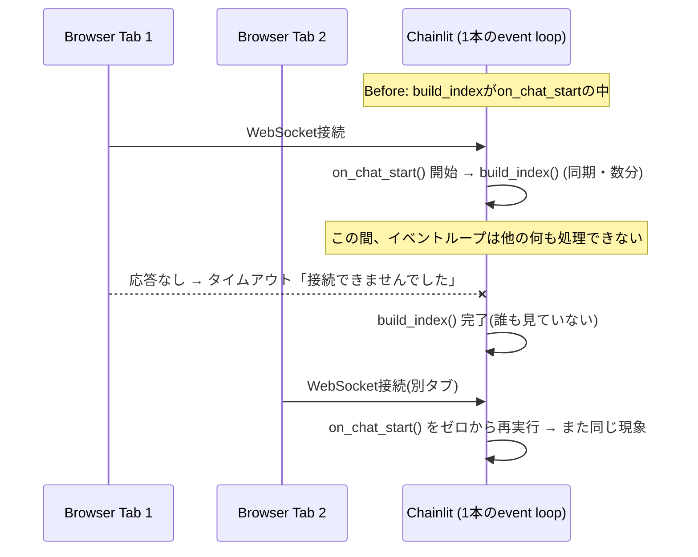
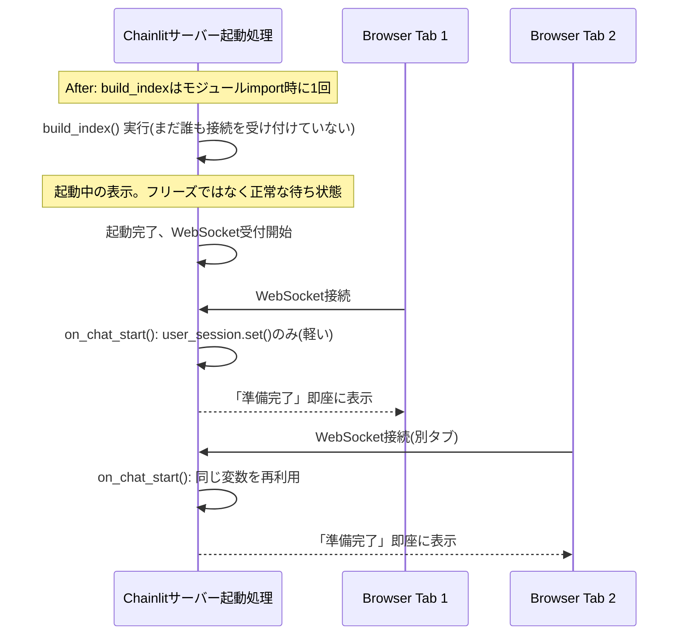

# Chainlit起動フリーズ問題: asyncioイベントループのブロッキング

> PR #8 (`fix/chainlit-startup-blocking`) の深掘り解説。
> 「async/awaitをちょっと忘れた」状態からでも読めば追えるように、前提知識から書く。
> 面接練習用に「1段の言い回し」も末尾に用意。関連: [insights.md](insights.md) Insight 05

---

## 0. 前提知識: asyncioのイベントループって何?

普通のPythonコードは「上から順に1行ずつ実行、終わるまで次に進まない」。これを **同期(sync)** と呼ぶ。

Webサーバーは「複数人が同時にアクセスしてくる」ことに対応しないといけない。方法は主に2つ:

| 方式 | やり方 | 例 |
|---|---|---|
| マルチスレッド/マルチプロセス | 人数分、別々の実行の流れ(スレッド)を用意する | 昔ながらのFlask等 |
| **非同期(asyncio)** | **1本の実行の流れ(イベントループ)** が、みんなの要件を少しずつ順番に処理する | Chainlit, FastAPI |

Chainlitは後者。**1つのイベントループが、全ユーザーの全セッションを裏で切り替えながら処理している。** `async def` で定義した関数(コルーチン)は、`await` と書いてある場所で「ここで一旦抜けて、他の人の処理に回っていいですよ」とイベントループに制御を返す。

**受付係のたとえ**: 窓口が1人(=1つのイベントループ)で、来客全員(=全セッション)の対応をしている。一人の書類に時間がかかりそうな時は「少々お待ちください、他の方の対応をしてきます」と言って他の人の対応に回れる(`await`のところ)。これが正常な非同期処理。

**問題が起きるパターン**: 受付係が、ある1人の分厚い書類作成(`await`を一切挟まない同期処理)を「終わるまで机から離れない」形でやり始めたら、**他の全員が完全に無視される**。受付係(プロセス)自体は死んでおらず仕事はしているが、外から見ると「誰も対応してもらえない、生きてるのか死んでるのか分からない」状態になる。これが今回起きたこと。

---

## 1. Before: 元の構造

```python
@cl.on_chat_start
async def start():
    llm = ChatGoogleGenerativeAI(...)
    split_docs, vectors = build_index(SEMANTIC_PATHS)   # ← ここが同期・重い処理
    df = load_receipts_as_dataframe(RECEIPT_PATHS)

    cl.user_session.set("llm", llm)
    cl.user_session.set("split_docs", split_docs)
    cl.user_session.set("vectors", vectors)
    cl.user_session.set("df", df)

    await cl.Message(content="RAG pipeline 準備完了。質問をどうぞ。").send()
```

`@cl.on_chat_start` は **「ブラウザが新しいチャットセッションを始めるたびに」Chainlitが自動で呼ぶ関数**。新しいタブを開く、ページをリロードする、これら全部が「新しいセッション」として扱われ、そのたびにこの関数が最初から実行される。

`build_index()` の中身は `embeddings.embed_documents(...)` という、レシート+LinkedIn全件(1万件超のchunk)をCPUでベクトル化する処理。これは**完全に同期関数**で、`await`は一切挟まない。数分かかる。

## 2. 何が実際に起きていたか(タイムライン)

「終わるまで待って、それでタイムアウトになった」という理解は半分正解、半分ズレている。正確には:

1. ブラウザがアプリを開く → ChainlitがWebSocket接続を開始
2. Chainlitが `on_chat_start()` をこのセッション用に呼ぶ
3. `build_index()` が走り出す。ここに `await` が無いので、**イベントループの制御が一切他に戻らない**
4. この数分間、**イベントループそのものが完全に専有される**。他のどんな通信(このセッションのWebSocketハンドシェイク完了処理を含む)も一切処理されない
5. ブラウザ側のWebSocketクライアントは「一定時間応答が無ければ諦める」設計になっているので、待ちきれずに「サーバーに接続できませんでした」を表示する。**これは"計算が遅くて待たされた末のタイムアウト"ではなく、"計算中はサーバーが文字通り何にも応答できない"という状態が可視化されたもの**、という違いが重要
6. 数分後、`build_index()` がようやく終わり、`on_chat_start()` も完了する。だがブラウザは既に諦めた後なので、ユーザーは「準備完了」メッセージを見られない

「毎回セッションや次のタブに行くとやり直さないといけない」という理解は**正しい**。`on_chat_start` は呼ばれるたびに `build_index()` を最初から実行するので、1つ目のタブでどれだけ待っても、2つ目のタブを開けばまた同じ数分がゼロから発生する。**セッション間でキャッシュも共有もされていなかった。**

## 3. After: 直した構造

```python
# モジュールレベル(ファイルの先頭)、on_chat_startの外
llm = ChatGoogleGenerativeAI(...)
split_docs, vectors = build_index(SEMANTIC_PATHS)
df = load_receipts_as_dataframe(RECEIPT_PATHS)

@cl.on_chat_start
async def start():
    cl.user_session.set("llm", llm)
    cl.user_session.set("split_docs", split_docs)
    cl.user_session.set("vectors", vectors)
    cl.user_session.set("df", df)

    await cl.Message(content="RAG pipeline 準備完了。質問をどうぞ。").send()
```

`llm` / `split_docs` / `vectors` / `df` の構築を、`on_chat_start`の**外**、ファイルのトップレベル(モジュールスコープ)に出した。Pythonはこのファイルを`import`した瞬間にトップレベルのコードを実行する。Chainlitでは、この`import`は**サーバープロセスが起動する時に1回だけ**発生し、しかも**WebSocket接続を受け付け始める前**に終わっている必要がある処理として扱われる。

## 4. 何が変わったか

| 観点 | Before | After |
|---|---|---|
| `build_index()`の実行タイミング | 新しいセッションが始まるたび | サーバープロセス起動時に1回だけ |
| 実行回数 | セッション数と同じ(N回) | 1回 |
| 重い処理が走っている間、サーバーは | 起動済みだが応答不能(外からは「フリーズ」に見える) | まだ起動シーケンス中(接続自体をまだ受け付けていない、正常な「起動中」表示) |
| 2つ目以降のタブ/セッション | また最初からやり直し(再びフリーズ) | 計算済みの変数を使い回すだけ(`user_session.set`は軽いdict書き込み) |
| フロントエンドの見え方 | 「サーバーに接続できませんでした」(原因不明のエラーに見える) | 起動完了までは単に繋がらない → 起動が終われば即座に使える |

## 5. 図解(before / after)





## 6. なぜこれが実務(SAPのようなEnterprise開発)で重要か

これは個人プロジェクト特有のバグではなく、**FastAPI/Starlette系の非同期WebフレームワークでCPUバウンドな同期処理を書くときに、非常によく踏む罠**として知られている。

- FastAPIの公式ドキュメントでも「`async def`のルートハンドラの中でブロッキングな同期処理(重いDB呼び出し、ML推論、ファイルI/O等)を直接呼ぶと、サーバー全体が固まる」と明記されている
- 対処のパターンは主に2つ、今回使ったのは1つ目:
  1. **重い初期化処理はアプリ起動時(startup/lifespanイベント)に1回だけ行い、リクエストごとには行わない**(今回の修正はこれ)
  2. **リクエストごとに避けられない重い同期処理がある場合は、スレッドプール(`run_in_executor`等)に逃がしてイベントループ自体は塞がない**
- Enterprise規模のRAG/AIサービスでは「モデルのロードやインデックス構築はアプリ起動時に1回」「推論リクエストはasyncハンドラで受けて重い部分だけexecutorに逃がす」という設計がほぼ標準

---

## 面接練習用: 1段の言い回し

「Chainlitアプリの起動時、`on_chat_start`という新しいチャットセッションが始まるたびに呼ばれるコールバックの中で、埋め込みベクトルの構築という重い同期処理を呼んでいました。ChainlitはFastAPI/Starlette系の非同期フレームワークで、全セッションを1本のイベントループで協調的に処理しています。`await`を挟まない同期処理を`async`関数の中で呼ぶと、その処理が終わるまでイベントループの制御が一切他に戻らず、他のユーザーの接続処理やWebSocketのやり取りが完全に止まります。結果、フロントエンドからは『サーバーに接続できませんでした』というエラーに見えていましたが、実際にはプロセスは生きていて、ただ応答できない状態でした。修正は、この重い初期化処理をリクエスト(セッション)ごとの処理から、アプリ起動時に1回だけ実行するモジュールレベルの処理に移したことです。」

## 深掘りされた時のフォールバック

- 「なぜ`await`が無いとブロックされるのか」→ Pythonのasyncioは協調的マルチタスキング。コルーチンは`await`地点でのみ制御を手放す設計なので、同期関数を挟むと文字通り制御が返らない
- 「マルチスレッドにすればいいのでは?」→ できるが、Chainlit自体がシングルイベントループ前提の設計。今回は「そもそもリクエストごとに重い処理を繰り返す必要がなかった」ので、実行タイミングを変えるだけで解決した(スレッドプールに逃がすのは、リクエストごとに重い処理が避けられない場合の話)
- 「キャッシュ(`.cache/`のpickle)との関係は?」→ 別レイヤーの話。今回の修正は「重い処理をいつ実行するか」、pickleキャッシュは「同じ入力に対する計算結果をディスクに保存して再計算そのものを省略する」。両方合わせて、初回起動はモジュールimport時に1回だけ計算・保存され、2回目以降の起動はそれすら読み込むだけになる
- 具体例: レシート+LinkedIn合計で1万件超のchunk、埋め込み計算に数分

**元の文脈**: [daily/2026-08-27.md](../2026-08-27.md), [docs/notes/chainlit-startup-freeze-and-index-cache.md](../../docs/notes/chainlit-startup-freeze-and-index-cache.md)
