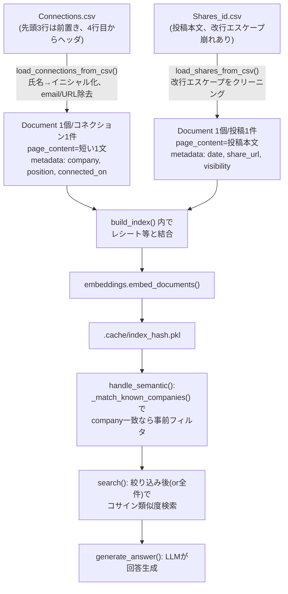

# データフロー復習: LinkedIn CSV → Document → 検索(company フィルタ含む)

> `src/load_linkedin.py` の構造を、生データから最終出力まで追って復習する。
> 該当するデイリーノートの専用記載は見つからなかったため(実装コミット: `ac2ec93` LinkedIn loader)、コードから構造を整理した。

---

## 0. 生データの形(2種類のCSV)

LinkedInのデータエクスポートは複数ファイルに分かれている。このプロジェクトで使っているのは2つ:

**`Connections.csv`**(誰と繋がったか。ただし先頭3行が説明文の**前置き**で、実データは4行目から):
```
Notes:
"When exporting your connection data, you may notice..."
                                                              ← 空行含めて3行分の前置き
First Name,Last Name,URL,Email Address,Company,Position,Connected On
Chuan,Meng,https://www.linkedin.com/in/chuan-meng-...,,The University of Edinburgh,Postdoctoral Researcher,12 Aug 2026
```

**`Shares_<id>.csv`**(自分が投稿した内容):
```
Date,ShareLink,ShareCommentary,SharedUrl,MediaUrl,Visibility
2026-07-28 20:32:32,https://...,"🎉Mein erster Geburtstag..."
```

## 1. Connections: GDPR/DSGVO配慮のイニシャル化がまず入る

```python
def load_connections_from_csv(filepath: str) -> list[Document]:
    df = pd.read_csv(filepath, skiprows=3)   # 前置き3行をスキップ
    docs = []
    for _, row in df.iterrows():
        company = row.get("Company")
        if pd.isna(company) or not str(company).strip():
            continue                          # Company空の行は除外
        initials = _initials(row.get("First Name"), row.get("Last Name"))
        ...
        page_content = f"{initials}, {position_display} at {company_display} (connected on {connected_on})."
        metadata = {
            "source": filepath, "initials": initials, "company": company,
            "position": position, "connected_on": connected_on,
            "year_month": connected_on[:7] if connected_on else None,
        }
        docs.append(Document(page_content=page_content, metadata=metadata))
```

**個人情報の扱いが他のloaderと違う**: 第三者(自分以外の人)のデータのため、そのままロードしていない。
- 氏名 → イニシャル化(`Chuan Meng` → `C.M.`)。`_initials()`は括弧書き(`Kunihiro (Kuni)`)を除去してから頭文字を取る
- メールアドレス・LinkedIn URL → そもそも`page_content`に含めない(正規表現`_EMAIL_PATTERN`でCompany/Position欄に紛れ込んだメール的文字列も除去)
- `__main__`の中に**プライバシー用のassert**まで入っている(`assert not _EMAIL_PATTERN.search(...)`, `assert "linkedin.com/in/" not in ...`)。ロード時に個人情報が漏れていないかを機械的に確認する設計

**page_contentの例**: `"C.M., Postdoctoral Researcher at The University of Edinburgh (connected on 2026-08-12)."`

**チャンク分割は無し**: 1行(1人のコネクション) = 1 `Document`。もともと短い1文なので、これ以上分割する必要がない。

## 2. Shares: 投稿本文のクリーニング

```python
def load_shares_from_csv(filepath: str) -> list[Document]:
    df = pd.read_csv(filepath)
    docs = []
    for _, row in df.iterrows():
        commentary = row.get("ShareCommentary")
        if pd.isna(commentary) or not str(commentary).strip():
            continue                          # 空commentary(単純リシェア)は除外
        page_content = _clean_share_commentary(str(commentary))
        metadata = {
            "source": filepath, "date": date_clean,
            "year_month": date_clean[:7] if date_clean else None,
            "share_url": row.get("ShareLink"), "has_media": bool(has_media),
            "visibility": row.get("Visibility"), "char_length": len(page_content),
        }
        docs.append(Document(page_content=page_content, metadata=metadata))
```

`_clean_share_commentary`は、LinkedInのCSVエクスポート特有の壊れ方(改行のたびに`"..."\n"..."`という形で前後をクォートで囲むエスケープ)を正規表現で直している。これも元データの品質問題への対処。

## 3. company メタデータフィルタとの接続(2026-08-27の追加分)

`Connections`のmetadataに`company`フィールドがあることが、後で効いてくる。`src/router.py`の`_match_known_companies()`は、この`company`の集合を使って「クエリに既知の会社名がそのまま含まれるか」を文字列一致でチェックし、一致すればその会社の`Document`だけに絞り込んでから検索する(詳細: [daily/2026-08-27.md](../2026-08-27.md))。**metadataを"後から検索フィルタとして再利用する"設計は、ロード時に構造化データをmetadataとして残しておいたからこそ可能になっている**、という点が2つの作業の繋がり。

## 4. 全体の流れ(図解)



---

## 面接練習用: 1段の言い回し

「LinkedInのConnections CSVは第三者のデータなので、氏名をイニシャル化し、メールアドレスやプロフィールURLはそもそもテキストに含めない設計にしました。ロード時にプライバシー保護のためのassertも入れて、機械的にPIIが漏れていないか確認しています。一方でCompanyやPositionのような属性はmetadataとして構造化して残しておいたので、後で検索精度の問題(固有名詞1語が埋め込み類似度の上位に来ない)が見つかった時に、このmetadataをそのまま検索フィルタとして再利用できました。ロード時にどんな情報を構造化して残すかという設計判断が、後の機能追加のしやすさに直結した例です。」

## 深掘りされた時のフォールバック

- なぜイニシャル化で十分と判断したか → 完全匿名化ではなく、Yamato自身が読んだ時に「誰のことか」思い出せる程度の情報は残す、という設計(GDPR/DSGVOの厳密な要件というより個人プロジェクトとしての妥当なバランス)
- Connections.csvの`skiprows=3`はLinkedInのエクスポート形式固有の癖で、汎用的なCSVパーサーの話ではない
- `_clean_share_commentary`の正規表現は実データを見て初めて気づいた壊れ方(改行のたびにクォートで囲むエスケープ)、事前に仕様書を読んで分かるものではなく実データ検証で発見した

**元の文脈**: `src/load_linkedin.py`, [daily/2026-08-27.md](../2026-08-27.md)(companyフィルタの実装経緯)
