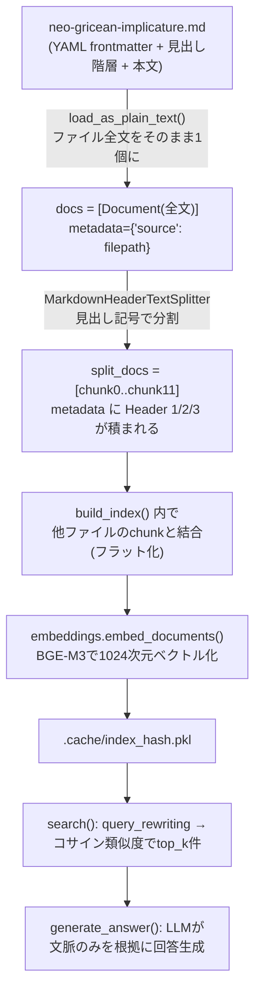

# データフロー復習: Markdownノート(Neo-Gricean等) → Document → chunk → 検索

> `src/load_markdown.py` の構造を、生データから最終出力まで追って復習する。
> このトピックは [daily/2026-08-10.md](../2026-08-10.md)(Day 3-4)に詳しい記録があったので、そこから再構成した。

---

## 0. 生データの形

`data/class-notes/neo-gricean-implicature.md` は、YAML frontmatter + 見出し階層(`#`/`##`/`###`) + Yamato本人のメモが混在する、ただのMarkdownファイル。他の2つ(レシートJSON、LinkedIn CSV)と違い**構造化データではなく自由記述のテキスト**。

## 1. なぜ`UnstructuredLoader`ではなく自作Loaderにしたか

最初は`UnstructuredLoader`(Load+Splitを一気にやる汎用ローダー)を試したが、Markdownで崩れた:

- YAML frontmatterでパーサーが混乱し、以降の本文が要素化されない
- `Document count 1`、`page_content`がfrontmatterだけになる不具合

**設計判断**: 「Load + Splitを一気にやる」汎用ツールは便利だが予測不能な崩れ方をする。**LoadとSplitを2つの独立したステップに分ける方が、何が起きているか追いやすい**。これが自作`load_as_plain_text()`(4行)+ `MarkdownHeaderTextSplitter`という組み合わせを選んだ理由([daily/2026-08-10.md](../2026-08-10.md)「詰まったこと・調べたこと」2番)。

## 2. Load: `load_as_plain_text()`(4行の自作ローダー)

```python
def load_as_plain_text(filepath: str) -> list[Document]:
    text = Path(filepath).read_text(encoding="utf-8")
    return [Document(page_content=text, metadata={"source": filepath})]
```

ファイル全文をそのまま1個の`Document`に入れるだけ。この時点では**まだ分割されていない**(`docs[0]`が「ファイル全文」を表す)。

## 3. Split: `MarkdownHeaderTextSplitter`

```python
headers_to_split_on = [
    ("#", "Header 1"), ("##", "Header 2"), ("###", "Header 3"),
]
splitter = MarkdownHeaderTextSplitter(headers_to_split_on=headers_to_split_on)
split_docs = splitter.split_text(docs[0].page_content)
```

各タプルは「左: Markdownの見出し記号(認識パターン)、右: metadataのキー名(格納先)」という対応。見出しの階層ごとにテキストを割り、**見出しの情報はmetadataに積まれる**(本文からは見出し記号自体は消える)。

## 4. `docs` と `split_docs` の関係(複数ファイルになった時の構造)

これが[daily/2026-08-10.md](../2026-08-10.md)の「学び②」でまとめられていた、最初は混乱しやすいポイント:

```
1ファイルの時:
docs        = [Document(全文)]                ← 要素1個、docs[0]だけ
split_docs  = [chunk0, chunk1, ..., chunk11]   ← 12個(見出しの数だけ増える)

3ファイルの時(QUD, Neo-Gricean, Speech Acts):
docs = [
    Document(QUD 全文),         # docs[0]
    Document(Neo-Gricean 全文),  # docs[1]
    Document(Speech Acts 全文),  # docs[2]
]
split_docs = [QUDの8chunks, Neo-Griceanの12chunks, Speech Actsの10chunks]
           = 30要素のフラットなリスト(ファイルの境界は無くなる)
```

**`docs`(Load直後)と`split_docs`(Split後)は別物**で、後段の検索・埋め込みは常に`split_docs`(フラットなリスト)を対象にする。どのファイル由来かは、各chunkの`metadata["source"]`を見ないと分からない、というのが「フラットなリストになる」ことの実務上の意味。

## 5. Document = 2属性だけ、という原則

`Document`オブジェクトは`page_content`(文字列)と`metadata`(辞書)の2属性のみ([docs/notes/langchain-and-rag-overview.md](../../docs/notes/langchain-and-rag-overview.md)で確認した一般構造そのもの)。属性アクセス(`doc.page_content`)と辞書アクセス(`doc.metadata["Header 1"]`)が混在するので、書く時に混同しやすい点として記録されていた。

## 6. なぜembeddingが必要か(このデータで検証された4つの理由)

素朴なキーワード検索ではなくembeddingを使う理由が、このNeo-Griceanノートを使った実験で具体的に確認されている([daily/2026-08-10.md](../2026-08-10.md)学び③):

1. **同義語で切れる**: 「Q原則って?」で「Q-principle」という表記にキーワード一致しない
2. **日英クロスで完全に切れる**: 日本語で聞いて英語ノートから探す、が文字列一致では不可能
3. **言い換え質問で切れる**: 「Hornの2分割は?」でQ-principle/R-principleを引けない
4. **意味的関連が拾えない**: 「LLMのhallucinationと含意理論」でこのノートを関連付けられない

コーパスが極小でcontext windowに全部入るなら省略可能だが、多言語+意味検索が要件のこのプロジェクトでは必須、という判断([daily/2026-08-10.md](../2026-08-10.md)学び③)。

## 7. 全体の流れ(図解)



## 8. このデータで見つかった検索精度の問題(復習: Semantic Gap)

このNeo-Griceanノートは、検索精度の問題を最初に発見した題材でもある。詳細は[insights.md](insights.md) Insight 01・03、[daily/2026-08-13.md](../2026-08-13.md)に記録済みだが、要点だけ:

- クエリ「Q-principleって何?」に対し、**Q-principle chunk自体が5位まで落ちる**現象が観測された
- 原因は2つに分離できた: ①Speech Actミスマッチ(質問形式と平叙文形式の型の不一致がPropositional Content一致より優先される)、②Chunk Size希釈(1chunkに定義+例+補足が全部入っていて意味が平均化される)
- 対処法もそれぞれ異なる(①Query Rewriting/HyDE、②Small-to-Big Retrieval)、という「1つの原因ではなく複数原因が独立に存在する」という発見がこのプロジェクトの独自性のひとつになっている

---

## 面接練習用: 1段の言い回し

「Markdownの学習ノートは、最初は汎用のUnstructuredLoaderで一気にLoad+Splitしようとしましたが、YAML frontmatterでパーサーが崩れました。LoadとSplitを2つの独立したステップに分けた方が、何が起きているか予測可能だと判断し、4行の自作ローダーとMarkdownHeaderTextSplitterの組み合わせに切り替えました。複数ファイルを扱うと、Load直後の`docs`(ファイル単位のリスト)とSplit後の`split_docs`(chunk単位のフラットなリスト)が別物になり、後段の検索は常にフラットなリストを対象にする、という構造を実装しながら理解しました。」

## 深掘りされた時のフォールバック

- なぜ`UnstructuredLoader`を完全に捨てなかったか → JSON(レシート)やCSV(LinkedIn)は自作パーサー(`json.loads`/`pandas.read_csv`)で十分構造が明確だったので、Markdownだけこの問題に当たった。ファイル形式ごとに最適なLoaderを選ぶ、という判断
- `metadata["source"]`の役割 → 複数ファイルがフラット化された後も、どのchunkがどのファイル由来か追跡するための唯一の手がかり
- なぜ見出し3階層(`#`/`##`/`###`)で区切ったか → このノートの構造がその階層に対応していたため。ファイルごとに見出し構造が違えば`headers_to_split_on`も変える必要がある

**元の文脈**: [daily/2026-08-10.md](../2026-08-10.md)(Load/Split/Embed/Visualizeの詳細), [daily/2026-08-13.md](../2026-08-13.md)(Semantic Gap発見), [docs/notes/langchain-and-rag-overview.md](../../docs/notes/langchain-and-rag-overview.md), [insights.md](insights.md) Insight 01・03
