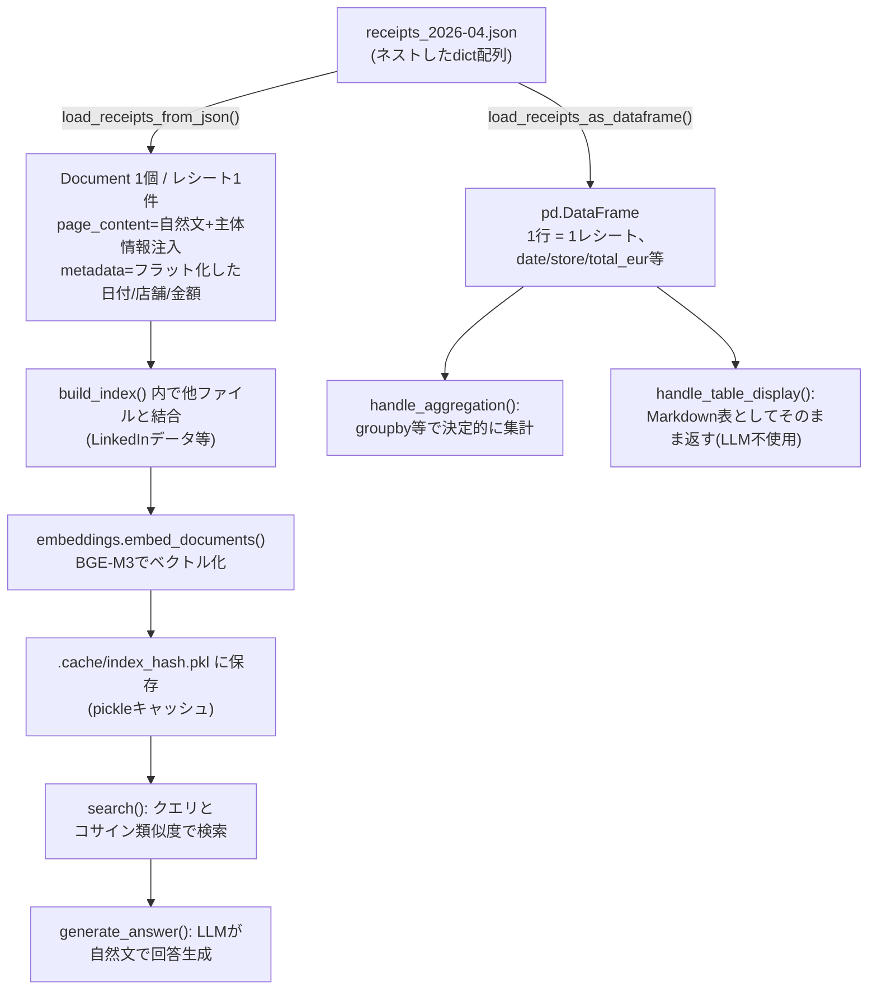

# データフロー復習: レシートJSON → Document → 検索/集計

> `src/load_receipts.py` の構造を、生データから最終出力まで追って復習する。
> 該当するデイリーノートの専用記載は見つからなかったため(実装コミット: `de6ef94` Day 7)、コードから構造を整理した。

---

## 0. 生データの形

`data/tuebingen/receipts_2026-04.json` はレシート1件を1オブジェクトとする配列:

```json
[
  {
    "receipt_id": "dm_20260429_01",
    "store": { "name": "dm-drogerie markt", "address": "Tübingen" },
    "transaction": {
      "date": "2026-04-29", "time": "00:00",
      "total_eur": 3.65, "exchange_rate_jpy": 184, "total_jpy": 671
    },
    "items": [
      {
        "name_original": "Balea MEN Duschgel...",
        "name_jp": "ボディソープ",
        "category": "Daily_Necessities",
        "price": { "regular_eur": 0.95, "discount_eur": 0.00, "final_eur": 0.95 }
      }
    ]
  }
]
```

ネストが深い(`store`, `transaction`, `items[].price` が全部dict)。この生データは**2つの全く別の用途**に、**2つの別関数**でそれぞれ別の形へ変換される。ここが今回のプロジェクトの重要な設計判断。

## 1. 2つの出口: semantic用とaggregation/table_display用

| 関数 | 出力 | 使う場面 | 何をするか |
|---|---|---|---|
| `load_receipts_from_json()` | `list[Document]` | semantic branch(概念質問への回答) | 1レシート → 自然文1本 + metadata |
| `load_receipts_as_dataframe()` | `pd.DataFrame` | aggregation/table_display branch(集計・一覧表示) | 全レシート → フラットな行の集合 |

**なぜ分けたか**: 「4月の合計は?」のような集計質問をLLM(embedding+生成)に解かせると、Router設計時の実験で**171件のレシートを読ませたら合計金額が+162 EURずれる**という不具合が実データで確認された(`load_receipts.py:119`のコメントに記録)。LLMは算術が不得意なので、集計はpandasの`groupby`等の決定的な計算に任せ、LLMは「どの集計関数を呼ぶか」の判断と結果の自然文整形だけを担当する設計にした。

## 2. semantic側: `load_receipts_from_json()` の変換

```python
def load_receipts_from_json(filepath: str) -> list[Document]:
    data = json.loads(Path(filepath).read_text(encoding="utf-8"))
    docs = []
    for receipt in data:                      # 1レシート = 1ループ
        page_content = _format_receipt_as_text(receipt)   # ネスト構造 → 自然文
        transaction = receipt.get("transaction", {})
        store = receipt.get("store", {})
        metadata = {
            "source": filepath,
            "receipt_id": receipt.get("receipt_id"),
            "date": transaction.get("date", ""),
            "store": store.get("name"),
            "store_address": store.get("address"),
            "total_eur": transaction.get("total_eur"),
            "total_jpy": transaction.get("total_jpy"),
            "month": transaction.get("date", "")[:7] or None,
        }
        docs.append(Document(page_content=page_content, metadata=metadata))
    return docs
```

**メタデータの取り方**: ネストしたdict(`receipt["transaction"]["date"]`等)から、必要な値だけをフラットな1階層の`metadata` dictに"引っ張り出して"いる。`Document.metadata`は基本的にフラットな辞書という前提([docs/notes/langchain-and-rag-overview.md](../../docs/notes/langchain-and-rag-overview.md)で確認済みの一般構造)に合わせて、ここで構造を平坦化している。

**page_contentの中身**(`_format_receipt_as_text`が生成する自然文の例):
```
【Tübingen で生活する日本人留学生 Yamato の生活費記録】
2026-04-29、dm-drogerie marktで 3.65 EUR の買い物をした。
購入品: ボディソープ(Daily_Necessities, 0.95 EUR), ...
```

冒頭の「【Tübingen で生活する...】」という一文は、Data Enrichmentという意図的な処理([insights.md](insights.md) Insight 04参照)。生のレシートには「誰の記録か」という主体情報が無いため、検索時に「留学生はどんな食べ物を買ってる?」のような質問とマッチしにくい(Common Groundの欠如)。全chunkの冒頭に主体情報を注入することで、この種の質問への一致度を上げている。

**チャンク分割は無し**: `src/rag_pipeline.py:89`のコメント通り「JSON は 1 レシート = 1 Document で既に分割済み、Split 不要」。Markdownのようにヘッダーでさらに割る処理はここでは行わない(1レシートの文量がもともと短いため)。

## 3. aggregation/table_display側: `load_receipts_as_dataframe()` の変換

こちらは`Document`を経由せず、`json.loads`した中身を直接フラットな行の辞書に変換して`pd.DataFrame`にする。`date`列は`pd.to_datetime`で型変換され、`groupby("month")`等での集計に使われる。citation artifact(`[cite: N]`のような混入テキスト)を`_strip_citation`で除去する処理も入っている(元データの品質問題への対処、`daily/2026-08-22.md`に記録済み)。

## 4. 全体の流れ(図解)



**ポイント**: 同じ生データ(JSON)から、質問の種類(`router.py`の`route()`が判定するintent)に応じて**2つの異なる経路**に分岐する。「何にでも使える1つの巨大な構造」を作るのではなく、用途ごとに最適な形(自然文+ベクトル検索 vs フラットな表+決定的計算)へ変換する、という設計判断が芯。

---

## 面接練習用: 1段の言い回し

「レシートのJSONはネストが深い構造でしたが、これを"意味を説明する質問"と"数値を集計する質問"という2つの異なる用途向けに、それぞれ別の関数で別の形に変換しています。前者は自然文のDocumentにしてベクトル検索、後者はフラットなDataFrameにしてpandasで決定的に集計します。1つの汎用フォーマットに寄せるのではなく、実際に171件のレシートをLLMに読ませて集計させたら金額が+162 EURずれるという実データの失敗を見た上で、用途別に変換経路を分けるという設計判断をしました。」

## 深掘りされた時のフォールバック

- なぜmetadataをフラットにするか → LangChainの`Document.metadata`は「テキスト1本+フラットなmetadata辞書」という2属性構造が前提([docs/notes/langchain-and-rag-overview.md](../../docs/notes/langchain-and-rag-overview.md))
- Data Enrichmentの副作用 → 全chunkに同じ主体情報テキストを注入すると、chunk同士の差別化が弱まる可能性がある(Griceの量の公理違反と読める、insights.md Insight 04参照)
- チャンク分割をしない理由 → レシート1件の文量がもともと短く、Small-to-Big Retrieval等の粒度調整が必要になるほど長くない

**元の文脈**: `src/load_receipts.py`, `src/rag_pipeline.py`, [insights.md](insights.md) Insight 04, [daily/2026-08-22.md](../2026-08-22.md)
