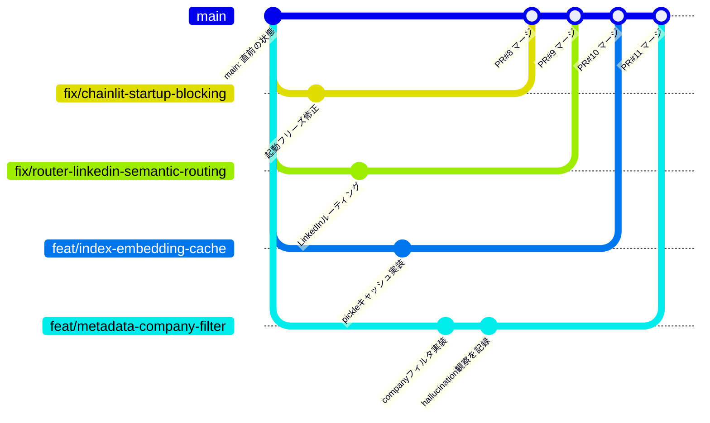
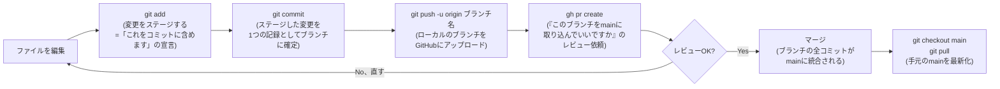

# Git: ブランチ→PR→マージのワークフロー

> これまでは`main`に直接commit+pushするだけだった。今日は初めてbranch→PR→mergeの流れを実際にやったので、そのやり方を図解で残す。
> 明日、GitHubにpushする作業の前に見返す用。

---

## 0. Before/After: 何が変わったか

| | これまで(直接コミット) | 今日から(ブランチ+PR) |
|---|---|---|
| 作業する場所 | `main`に直接 | `main`から分岐した専用のブランチ |
| 変更の確定 | `git commit`→即座に`main`の履歴に残る | `git commit`はブランチの履歴にだけ残る、`main`はまだ変わらない |
| 公開 | `git push`で即座に`main`が更新される | `git push`はブランチだけをアップロード、`main`はまだ変わらない |
| レビュー | 無し | `gh pr create`でレビュー依頼、OKが出るまで`main`に入らない |
| 複数の作業 | 同時にやると1本の履歴が混ざる | ブランチごとに独立、今日のように4つ同時に動かせる |

## 1. 全体像(太い幹から枝が伸びて、また幹に還る)

これが今日実際にやったこと(PRのマージ自体はまだ、明日の作業)。**`main`という1本の太い幹があり、そこから作業ごとに細い枝(ブランチ)が伸びて、それぞれ独立して育ち、OKが出たら1本ずつ幹に合流していく**、というのが全体構造。4つ同時に枝を伸ばせるのは、それぞれが独立した履歴だから(互いに干渉しない)。

## 2. 1本のブランチを拡大すると(ズームイン)

**今回やった順番の実例**(`feat/metadata-company-filter`):

1. `git checkout -b feat/metadata-company-filter` — `main`から新しい枝を作って、そこに移動
2. `src/router.py`を編集
3. `git add src/router.py daily/2026-08-27.md` — 変更をステージ
4. `git commit -m "..."` — このブランチに1つの記録として確定(**まだmainには一切影響しない**)
5. `git push -u origin feat/metadata-company-filter` — このブランチをGitHubにアップロード(**まだmainには一切影響しない**)
6. `gh pr create --base main --head feat/metadata-company-filter ...` — 「このブランチをmainに入れていいですか」のレビュー依頼を作成(PR #11として作成された、これも**まだmainには影響しない**)
7. (明日やる)レビューして問題なければマージ → **ここで初めてmainにこの変更が反映される**

## 3. コマンド早見表

| コマンド | やること | mainに影響する? |
|---|---|---|
| `git checkout -b <name>` | `main`から新しいブランチを作って移動 | しない |
| `git add <file>` | 変更をステージ(次のcommitに含める準備) | しない |
| `git commit -m "..."` | ステージした変更をブランチの履歴に確定 | しない(そのブランチだけ) |
| `git push -u origin <branch>` | ブランチをGitHub(リモート)にアップロード | しない(そのブランチだけ、`main`ブランチをpushしない限り) |
| `gh pr create` | 「このブランチをmainに取り込みたい」というレビュー依頼を作る | しない(依頼を作るだけ) |
| レビュー・マージ(GitHub上のボタン or `gh pr merge`) | 承認された変更を実際に`main`に統合する | **する、ここが唯一mainを変える瞬間** |
| `git checkout main && git pull` | 手元の`main`を、GitHub上の最新`main`に合わせる | しない(取り込むだけ、更新はGitHub側で既に起きている) |

**一番大事なポイント**: `commit`・`push`・`pr create`は全部**mainより手前**の準備段階で、**マージだけがmainを実際に変える**。だから作業中に何度commitやpushをやり直しても、マージするまでは`main`は無傷のまま、という安心感がブランチ運用の一番の利点。

## 4. 用語集

- **ブランチ(branch)**: `main`から分岐した、独立した作業履歴の線。ここに何回commitしても`main`は変わらない
- **コミット(commit)**: 変更のスナップショットを1つ記録すること。ブランチの履歴に積まれる
- **プッシュ(push)**: 手元(ローカル)の変更をGitHub(リモート)に送ること。ブランチをpushしても、そのブランチがGitHub上に見えるようになるだけで`main`は変わらない
- **プルリクエスト(PR / Pull Request)**: 「このブランチの変更を`main`に取り込んでいいですか?」というレビュー依頼。作成しただけではまだ何も統合されない
- **マージ(merge)**: レビューが通った後、ブランチの変更を実際に`main`に統合すること。ここで初めて`main`の履歴が変わる
- **リモート(remote)/ origin**: GitHub上にあるこのリポジトリの実体。手元のPC上の作業(ローカル)と対になる概念。`git push`はローカル→リモート、`git pull`はリモート→ローカルの向き

---

## 面接練習用: 1段の言い回し

「これまでは`main`に直接commit・pushしていましたが、今日から複数の変更を並行して進めるために、ブランチ→PR→マージのフローに切り替えました。作業ごとに`main`から独立したブランチを作り、そのブランチの中でcommit・pushを何度やり直しても`main`には一切影響しません。GitHubのPull Requestでレビュー依頼を作り、承認されて初めてマージという操作で`main`に統合されます。この仕組みのおかげで、今日は起動フリーズ修正・キャッシュ・LinkedInルーティング・検索精度改善という4つの独立した変更を、互いに干渉させずに同時並行で進められました。」

## 実例: 実際に起きたコンフリクトの解決

並行ブランチが同じ関数を別の理由で変更し、片方が先にマージされた後もう片方でコンフリクトした実例(タイムライン図解・解決手順つき): [parallel-branch-merge-conflict-case-study.md](parallel-branch-merge-conflict-case-study.md)
