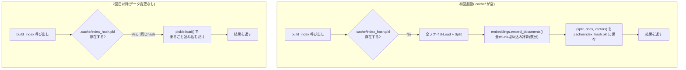

# インデックスキャッシュ(pickle)の役割

> PR #10 (`feat/index-embedding-cache`) の深掘り解説。
> [chainlit-asyncio-event-loop-blocking.md](chainlit-asyncio-event-loop-blocking.md) の続編(同じPRの別レイヤーの話)。
> 関連: [docs/notes/chainlit-startup-freeze-and-index-cache.md](../../docs/notes/chainlit-startup-freeze-and-index-cache.md)

---

## 0. 自分の「キャッシュ」の理解と、今回のキャッシュのズレを先に確認する

自己申告の理解: 「毎回繰り返さなくてもいいように何かを残しておいて、後で必要な時に必要なだけ情報を持ってくる」

これは**キャッシュという概念全般としては正しい**。ただしキャッシュには複数の種類があり、今回実装したものはその中の**1種類だけ**にあたる。混同しやすいポイントを先に切り分ける。

| 種類 | 何を残すか | いつ使うか | 例 | 今回これ? |
|---|---|---|---|---|
| **計算結果のメモ化(memoization)** | 「同じ入力 → 同じ出力」が保証された重い計算の**結果そのもの** | 次回、同じ入力が来た時に計算を丸ごと省略 | 今回の`.cache/index_<hash>.pkl` | **○ これ** |
| ユーザー設定の永続化 | ユーザーが選んだ設定・好み | 次回起動時に読み込んでUIに反映 | ブラウザの「ログイン状態を保持」 | × |
| 部分取得・遅延読み込み | データ全体ではなく、今必要な一部だけ | ページング、無限スクロール | DBの`LIMIT`句、CDNの範囲リクエスト | × |
| LRU/TTLメモリキャッシュ | アクセス頻度・時間で自動的に入れ替わるキャッシュ | 頻繁にアクセスされるデータを高速に返す | Redis、ブラウザのHTTPキャッシュ | × |

「必要な時に必要なだけ情報を持ってくる」という理解は、どちらかというと2列目(部分取得)のイメージに近い。しかし**今回実装したのは全く逆で、「全部まとめて計算して、全部まとめて保存し、全部まとめて読み込む」**という一括処理型のメモ化。部分的に取ってくる仕組みではない。この違いは後述の図で明確になる。

---

## 1. 何を、何をキーにキャッシュしているか

キャッシュしているのは **`(split_docs, vectors)` のタプル1個**。

- `split_docs`: レシート+LinkedIn全件をLoad+Splitした後の`Document`オブジェクトのリスト
- `vectors`: 各`Document`を埋め込みモデル(BGE-M3)でベクトル化した結果のリスト(`split_docs`と同じ順番・同じ件数)

キャッシュキー(ファイル名)は、**対象ファイル群(パス+更新日時+サイズ)をまとめてハッシュ化した値**:

```python
def _index_cache_path(filepaths: list[str]) -> Path:
    parts = []
    for path in filepaths:
        st = Path(path).stat()
        parts.append(f"{path}:{st.st_mtime_ns}:{st.st_size}")
    digest = hashlib.sha256("|".join(parts).encode()).hexdigest()
    return _CACHE_DIR / f"index_{digest}.pkl"
```

「同じデータファイル群(中身が変わっていない)」→「同じハッシュ」→「同じキャッシュファイル」という対応関係。データファイルが1つでも変わると、ハッシュ全体が変わり、**キャッシュ全体が作り直しになる**(部分更新はできない、これは制約として意識しておく必要がある)。

## 2. 図解: 初回起動 vs 2回目以降



図の通り、2回目以降のルートには「1件ずつ処理」も「必要な分だけ取ってくる」もない。ファイル1個をまるごとメモリに展開しているだけ。これが「一括メモ化型」であって「部分取得型」ではない理由。

## 3. なぜ検索(search)自体はキャッシュしていないのか

`search()`が行う「クエリを埋め込んで、既存ベクトル全部とコサイン類似度を計算する」処理はキャッシュ対象外。理由は単純で、**質問文はリクエストのたびに変わる**(「同じ入力→同じ出力」が成立しない)ので、メモ化の前提が成り立たない。

キャッシュが効くのは「入力が固定/めったに変わらない、かつ計算が重い」という条件を満たす処理だけ。今回のプロジェクトで言えば:

| 処理 | 入力は固定的? | 重い? | キャッシュ対象? |
|---|---|---|---|
| ドキュメント埋め込み(`build_index`) | ○(データファイルが同じ限り) | ○(数分) | **○ 今回対応** |
| 質問の埋め込み・類似度計算(`search`) | ×(毎回違う質問) | ×(一瞬) | 対象外 |
| HuggingFace Hubへのモデルダウンロード確認 | ○(モデルは同じ) | 通信次第で重い | `HF_HUB_OFFLINE=1`で対応(pickleとは別の仕組み) |

## 4. 既知の制約(面接で聞かれたら答えられるように)

- **埋め込みモデル自体を変えても検知できない**: キャッシュキーはデータファイルのパス・更新日時・サイズのみを見ていて、モデル名(`BAAI/bge-m3`)はキーに含まれていない。モデルを差し替えても古いベクトルのキャッシュが読み込まれてしまう(手動で`.cache/`を消す必要がある)
- **全部か無かの粒度**: レシート1件を追加しただけでも、対象ファイル全体のハッシュが変わり、コーパス全体を再計算する。本来のVector DB(ChromaDB/pgvector)なら1件だけupsertできる
- **プロセス間で共有されない**: `.cache/`はディスク上のファイルなので複数プロセスから読めるが、読み込んだ後は各プロセスのメモリに別々に展開される(共有メモリではない)

---

## 面接練習用: 1段の言い回し

「起動のたびにレシート+LinkedIn全件の埋め込みを計算し直していて、数分かかっていました。データファイル群のパス・更新日時・サイズからハッシュキーを作り、計算結果(chunkとそのベクトル)をpickleでディスクに保存するようにしました。同じデータであれば次回以降は計算をスキップしてファイルから読み込むだけになります。これは典型的な計算結果のメモ化で、質問文の検索自体はリクエストごとに変わるためキャッシュ対象にはしていません、"入力が固定で計算が重い部分だけをキャッシュする"という条件で線引きしました。」

## 深掘りされた時のフォールバック

- 「なぜRedisやMemcachedを使わないのか」→ 単一プロセス・単一マシンの個人プロジェクトなので、ディスクへのpickle保存で十分。複数プロセス/複数マシンで共有する必要が出たら外部キャッシュストアの出番になる
- 「pickleのセキュリティリスクは?」→ pickleは任意コード実行のリスクがあるため、信頼できない出所のファイルを読み込むのは危険。今回は自分のマシンで自分が生成したファイルのみを読むので問題ないが、配布・共有する設計には使わない
- 「本来のVector DB(ChromaDB/pgvector)と何が違うか」→ [chainlit-asyncio-event-loop-blocking.md](chainlit-asyncio-event-loop-blocking.md)とは別トピックだが、`daily/2026-08-27.md`の「まだ理解が浅い/今後の検討点」に記録済み。pickleは「再計算をサボる」ための応急処置で、インデックス検索・増分更新・複数プロセス同時アクセスといったVector DBの利点はまだ得られていない

**元の文脈**: [daily/2026-08-27.md](../2026-08-27.md), [docs/notes/chainlit-startup-freeze-and-index-cache.md](../../docs/notes/chainlit-startup-freeze-and-index-cache.md)
