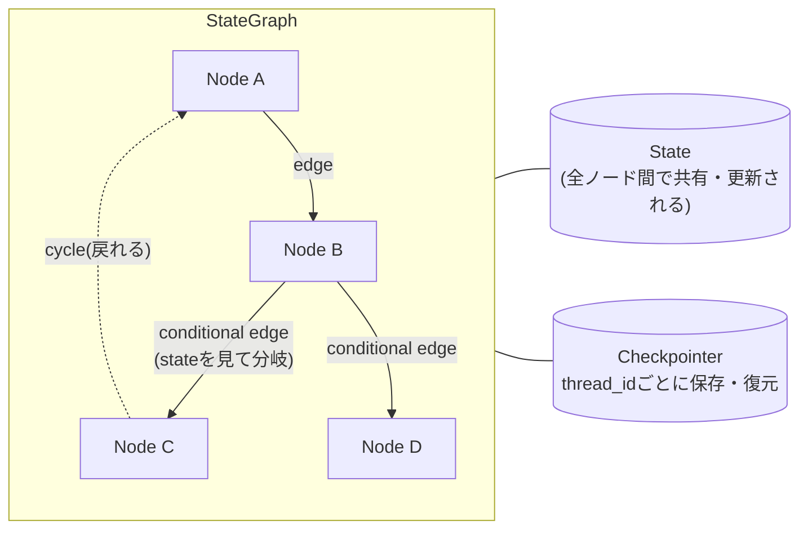

# LangGraph 101

> Issue #23。実装は[hello_langgraph.py](../../src/hello_langgraph.py)(TODOスキャフォールド、自分で書く)。
> このファイルは概念・業界での使われ方・言語学とのつながりをまとめる。

---

## 0. そもそも何のためにあるか

2023年頃から、「1回のプロンプトで1回answerを返す」という素朴な形のLLMアプリでは、複数ステップの推論・自己修正・長い会話の記憶が必要なタスクに対応しきれない、という認識が業界で広がった。LangGraph(LangChainチーム製)は、こうした**複数ステップで、状態を持ち、時にはループする**処理を、明示的で追跡可能な形で組むためのライブラリ。同じ課題への競合ツールとしてMicrosoftのAutoGen、CrewAI等もあるが、LangGraphはLangChainのエコシステム(このプロジェクトが既に使っている`langchain_google_genai`等)と自然に繋がるのが強み。

## 1. 核となる5つの概念

| 概念 | 何か |
|---|---|
| **State** | 全ノード間で引き継がれる状態(会話履歴、クエリ、検索結果など)。TypedDictやPydanticで型を決める |
| **Node** | 1つの仕事をするPython関数。状態を受け取り、更新分を返す |
| **Edge** | ノード間の繋がり。固定の繋がりと、**状態を見て次を決める条件付きの繋がり(conditional edge)**がある。今の`route()`はこれをif/elifで手作りしている |
| **Cycle(サイクル)** | 前のノードに戻れる。普通のパイプライン(DAG、例: Airflow)には無い、LangGraph最大の特徴 |
| **Checkpointer** | 各ノード実行後の状態を保存する仕組み。`thread_id`ごとに保存・復元、これが会話の記憶を実現する |

## 2. 業界での使われ方(検証済みの参照点)

正直に言うと、SAP社内で実際にLangGraphがどう使われているかの内部情報は持っていない。ただし**このプロジェクト自体が既に持っている、検証済みの参照点**がある: `docs/why.md`に記録した、SAP Working StudentのEceさんのプロファイル。

- Skills: LangChain, **LangGraph**, Alembic, SQLAlchemy, PostgreSQL, RAG, Prompt Engineering, Deep Agents
- プロジェクト例: AI Observability Agent(Loki + Prometheus)、Kubernetes向けドキュメント自動生成PoC、Concourse CIパイプラインのroot cause分析AIエージェント

これらは全て「1回のプロンプト応答」では済まない、**複数ステップで状態を持つエージェント的タスク**(ログを見て→原因を絞り込んで→レポートを書く、のような)で、まさにLangGraphが設計されている領域と一致する。一般論として、業界でLangGraph的な設計が採用されるのは「単純なQ&Aを超えて、複数ステップの意思決定や長い会話の記憶が必要になった時」という原則は、この実例からも裏付けられる。

## 3. Pain Point → LangGraphがどう効くか

| Pain Point(このプロジェクトで実際に発見した課題) | 素朴な実装での限界 | LangGraphがどう効くか |
|---|---|---|
| フォローアップ質問(「それぞれの役職は?」)が解けない(`daily/2026-08-20.md`) | `@cl.on_message`が毎ターン独立、会話履歴を持たない | Checkpointerがthread_idごとに会話履歴を保存・復元。以前のstateを次のノードに渡せる |
| 複数エンティティを跨いだ推論(Issue #16の意味的なケース) | if/elifのRouterは1回判定したら後戻りできない | Cycleで「検索→評価→不十分なら再検索」のようなループが組める |
| Routerの判定ロジック自体 | if/elifで手書き、状態を持たない | Conditional edgeとして正式にモデル化される(ロジック自体は変わらない) |

## 4. 計算言語学(CL)とのつながり

- **State = Common Ground**: `daily/2026-08-19.md`で既に確認済みの理論的対応(`cl.user_session` = per-user Common Ground)。LangGraphのCheckpointerは、この対応を**実装として永続化する**もの
- **Conditional edge = QUD型判定**: `route()`が「質問のタイプに応じて処理を振り分ける」のは、Robertsの QUD (Question Under Discussion) 理論の実装そのもの(`pragmatics-in-rag-query-processing.md`参照)。LangGraphではこれが正式なグラフ構造として表現される
- **指示語解決ノード = Deixis(直示表現)の解決**: 「それぞれ」「この人」のような直示表現は、発話時点のコンテキスト(=会話履歴という状態)を参照して初めて具体的な指示対象に解決される。Issue #21で作る「contextualizeノード」は、まさにこの言語学的な操作をコードにしたもの

---

## 面接練習用: 1段の言い回し

「LangGraphは、複数ステップで状態を持ち、時にはループする処理を明示的に組むためのオーケストレーションライブラリです。私のプロジェクトのRouterは、実は素のPythonでLangGraphの基本パターン(状態を見て次のノードを決める条件付きedge)を手作りしていました。会話履歴を必要とするフォローアップ質問への対応という具体的な課題があったので、そこを解決するためにLangGraphのCheckpointer機構を導入しています。私のComputational Linguisticsのバックグラウンドで言うと、これはStalnakerのCommon Groundを実装として永続化する作業だと捉えています。」
