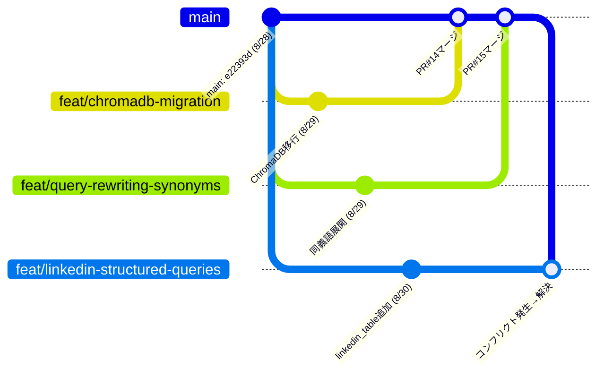

# 実例: 並行ブランチによるマージコンフリクトはなぜ起きたか

> [git-branch-pr-merge-workflow.md](git-branch-pr-merge-workflow.md)の実例編。2026-08-30、PR #20(`feat/linkedin-structured-queries`)をマージしようとした時に実際に起きたコンフリクトの記録。

---

## 0. まず結論: 「同じ場所を、別の理由で、同時に変更した」から起きた

PR #14(ChromaDB移行)とPR #20(LinkedIn構造化クエリ)は、**どちらも`router_answer()`という同じ関数のシグネチャを書き換えていました**。理由は全く別です:

- PR #14: `split_docs, vectors`(2引数)を`collection`(1引数)に統合(ChromaDB移行)
- PR #20: `linkedin_df`という新しい引数を追加(LinkedIn構造化クエリ用)

2つのPRは互いの存在を知らずに(同時進行で)同じ行を触っていたので、後からマージしようとした時に「どちらを採用すればいいか分からない」状態になりました。

## 1. 実際のタイムライン(図解)



**ポイント**: 3つのブランチ(`feat/chromadb-migration`、`feat/query-rewriting-synonyms`、`feat/linkedin-structured-queries`)は**全部同じコミット(`e22393d`)から分岐**しています。`chromadb-migration`と`query-rewriting-synonyms`は互いに触るファイルが被らなかったのでスムーズにマージできましたが、`linkedin-structured-queries`だけは`chromadb-migration`と同じ関数を触っていたので、**自分が分岐した後にmainが先に進んでしまい、そこに追いつこうとした時にコンフリクトした**、という状態です。

## 2. なぜコンフリクトの範囲が、思ったより広かったのか

実際に出たコンフリクトは、シグネチャ1行だけでなく、**`handle_linkedin_table`という新しい関数まるごと**を巻き込んだ範囲でした:

```
<<<<<<< HEAD
def handle_linkedin_table(query: str, linkedin_df: pd.DataFrame) -> str:
    ...(30行くらいの関数まるごと)...

def router_answer(query: str, split_docs: ..., vectors: ..., df: ..., linkedin_df: ..., llm) -> str:
=======
def router_answer(query: str, collection, df: pd.DataFrame, llm: BaseChatModel) -> str:
>>>>>>> origin/main
```

**理由**: gitの差分検出は行単位で「両側の変更が近すぎて、どこからどこまでが本当に競合しているのか」を細かく判定できないことがあります。今回は「新しい関数を丸ごと追加した箇所のすぐ後ろにある行」を両側で書き換えていたので、gitは「この一帯はまとめて競合している」と広めに判定しました。**中身をよく見れば、`handle_linkedin_table`関数自体は片方(このブランチ)にしか存在せず競合していない**のですが、conflict markerの外からは一見「関数ごと競合している」ように見えてしまう、という点が今回の分かりにくさの原因でした。

## 3. なぜ「片方を選ぶ」だけでは解決しなかったのか

これは、以前(`daily/2026-08-27.md`絡みのコンフリクト)とは**性質が違うコンフリクト**でした:

| | 前回(daily note) | 今回(router_answer) |
|---|---|---|
| 関係性 | 片方がもう片方を完全に含む(スーパーセット) | 両方とも、相手には無い独自の変更を持つ |
| 正しい解決 | Incoming(main)を丸ごと採用すればOK | 両方の変更を手で組み合わせる必要がある |

今回、Incoming(main)だけを採用すると`linkedin_df`が消えてPR #20の意味が無くなり、Current(このブランチ)だけを採用すると、ChromaDB移行後の`router.py`本体(`_match_known_companies`や`handle_semantic`が既に`collection`を前提にしている)と噛み合わなくなり、動かなくなります。

## 4. 実際にどう解決したか

GitHub上のWeb編集ではなく、**ローカルで解決**しました:

```bash
git fetch origin
git checkout feat/linkedin-structured-queries
git merge origin/main          # ← ここでコンフリクトが再現される
```

コンフリクトが出たファイル(`src/router.py`, `src/chainlit_app.py`)を開き、**両方の変更を含む形に手で書き直す**:

```python
# Before(競合していた2つの版)
def router_answer(query, split_docs, vectors, df, linkedin_df, llm): ...   # このブランチ
def router_answer(query, collection, df, llm): ...                          # main

# After(両方を組み合わせた正しい版)
def router_answer(query, collection, df, linkedin_df, llm): ...
```

その後:
```bash
# 実際に動くことをテストで確認してから
git add src/router.py src/chainlit_app.py
git commit          # マージコミットが作られる
git push origin feat/linkedin-structured-queries
```

**ローカルで解決した理由**: GitHubのWeb編集は1ファイルずつ、テキストの見た目だけで判断することになりがちです。今回のようにコード的な整合性(関数のシグネチャと呼び出し側が一致しているか)を保ちながら複数箇所を直す必要がある場合、**実際にコードを実行してテストできるローカル環境の方が、コンフリクト解決後に「本当に動くか」を確認できて安全**です。

## 5. 一般的な教訓: なぜこの手のコンフリクトは起きるのか、減らすには

**同じ関数のシグネチャを、複数のブランチが並行して触っていると起きやすい**、というのが今回の一番の学びです。個人開発でも、複数の機能を同時並行で進める(今回のように3ブランチ同時)場合には避けにくい現象です。

減らす方法(実務でもよく使われる):
- **ブランチを長く放置しない**: 分岐してから時間が経つほど、mainとの差分が広がりコンフリクトのリスクが上がる。こまめに`git merge main`(または`git rebase main`)してブランチを最新に保つ
- **同じファイル・同じ関数を触る作業は、可能なら1本のブランチにまとめる、または順番に進める**: 今回のように「関数シグネチャを変える」作業(ChromaDB移行)と「別の理由でその関数を拡張する」作業(LinkedIn構造化クエリ)が重なるなら、先に片方をマージしてから、もう片方を分岐し直す方が衝突しない

---

## 面接練習用: 1段の言い回し

「複数のブランチを並行して進めていたところ、2つのブランチが同じ関数のシグネチャを別々の理由で変更しており、片方が先にマージされた後、もう片方でマージコンフリクトが発生しました。単純にどちらかを採用するのではなく、両方の変更(ChromaDBへの移行と、新しい引数の追加)を実際にコードとして組み合わせる必要があったため、GitHub上のWeb編集ではなくローカルで`git merge`し、動作確認をした上でコミットしました。」

**元の文脈**: [git-branch-pr-merge-workflow.md](git-branch-pr-merge-workflow.md), PR #20, PR #14
