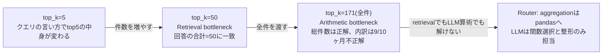

# 意味論・語用論の知識がRAGにどう応用されたか

> Loading→Split→Embeddingの復習([data-flow-*.md](.)3ファイル)の続き。
> ここではRAG特有の話 — 質問の種類判定、クエリのリライト、Gemini APIの応答、top_k実験 — を扱う。
> 既存の[insights.md](insights.md) Insight 01〜04と重複する部分は要約に留め、リンクで飛べるようにしている。

---

## 0. 全体像: どの言語学理論がどのエンジニアリング判断に対応したか

| 言語学の概念 | 分野 | 対応したエンジニアリング判断 | 詳細 |
|---|---|---|---|
| Speech Act(発話行為)/ Illocutionary Force | 語用論 | Query RewritingでDirective→Assertiveに変換 | Insight 01 |
| Common Ground(共有前提) | 語用論(Stalnaker) | Data Enrichment(chunk冒頭に主体情報を注入)、`cl.user_session` | Insight 04, 本ファイル §3 |
| QUD (Question Under Discussion) | 語用論(Roberts) | Router の intent 3分類(semantic/aggregation/table_display) | 本ファイル §1 |
| Grice の Manner Maxim(be perspicuous) | 語用論(Grice) | Query Rewritingを「話者の曖昧さをシステムが事後補正する」機構と位置づけ | 本ファイル §2 |
| Quantity Maxim(言い過ぎない) | 語用論(Grice) | Enrichmentの副作用(全chunkに同じ文言を注入する量的コスト) | Insight 04 |

**このマッピングの意義**: 「なんとなくRAGを組んだら動いた」ではなく、失敗パターンを言語学の枠組みで分類できたことで、**原因ごとに違う対処法を選べた**。これが本ファイルの軸。

---

## 1. 質問のタイプ判定(QUD理論とRouterの対応)

Roberts の QUD (Question Under Discussion) 理論では、**質問のタイプによって"何が適切な答えか"が決まる**。「何?」型の質問には説明文が、「いくつ?」型の質問には数値が、"一覧で"型の質問には構造化された列挙が、それぞれ適切な答え方として要求される。

このプロジェクトの`route()`(`src/router.py`)が判定する3分類は、まさにこのQUD型の分類に対応している:

| Intent | 対応するQUD型 | 例 | 処理層 |
|---|---|---|---|
| `semantic` | 概念・説明を問う型 | 「Q-principleって何?」 | 既存RAGパイプライン(embedding検索+LLM生成) |
| `aggregation` | 集合内の数値・順序を問う型 | 「4月の合計は?」「一番高いのは?」 | pandas決定的計算(§4で詳述) |
| `table_display` | 個別レコードの列挙を問う型 | 「レシート全部見せて」 | Markdown表(LLMを経由せず直接返す) |

**なぜこれが重要か**: 素朴なRAG(embedding検索1本)は「関連情報の想起」型の質問にしか向いていない。「一番高い買い物は?」のような集合演算型の質問は、QUD的に別の型なので**RAGの設計目標の外側**にある。これは実データで確認済み(§4参照)。Routerは「QUD型を判定して、型に応じたretriever/処理系に振り分ける」語用論的な仕組みとして実装されている。

---

## 2. Query Rewritingの仕組みと、語用論的な位置づけ

### 2.1 実装(`src/query_rewriting.py`)

```python
def expand_query_to_definition(query: str, llm) -> str:
    system_prompt = """
    ユーザーの質問を、embeddingベースの検索で関連文書がヒットしやすい形に書き換えてください。
    ルール:
    - 質問文ではなく、定義的な平叙文の形にする
    - 関連する専門用語、同義語、期待される答えの語彙を含める
    """
    message = [SystemMessage(content=system_prompt), HumanMessage(content=f"入力: {query}\n出力:")]
    response = llm.invoke(message)
    return response.text.strip()
```

**入出力の例**(docstring内):
```
入力: "光合成って何?"
出力: "光合成の定義とプロセス。植物が光エネルギーを化学エネルギーに変換する過程で、
       二酸化炭素と水から糖と酸素を生成する反応。"
```

質問形式(Directive、相手に情報提供を要求する発話)を、定義的な平叙文(Assertive、事実を主張する発話)に変換している。これは`src/rag_pipeline.py`の`search()`内で`use_rewriting=True`の時だけ呼ばれる(`handle_semantic`は常に`use_rewriting=True`で呼んでいる)。

### 2.2 なぜこれが必要か(Speech Actミスマッチ、Insight 01の要約)

BGE-M3のような埋め込みモデルは、命題内容(Propositional Content)の一致より**発話の型(Illocutionary Force)の一致**を優先する傾向がある。「Q-principleって何?」という質問(Directive)は、同じ質問形式で書かれたchunk(例: 別の概念へのメモ)と近くなりやすく、実際に答えるべき定義文chunk(Assertive)より順位が下がることが実データで確認された(スコア: 背景chunk 0.4398 vs Q-principle chunk 0.3833、僅差で逆転)。Query Rewritingは、この型のミスマッチを埋める処理。

### 2.3 語用論的な位置づけ: Griceの Manner Maxim補正

Griceの協調の原理には「Be perspicuous(明瞭に話せ)」というManner Maximがある。ユーザーの実際の入力(typo、省略、曖昧な言い回し)はこの公理を完全には満たさない。Query Rewritingは、**システム側がユーザーに代わってManner Maximを満たす形に書き直す、pragmatic repair(語用論的修復)機構**として位置づけられる(`daily/2026-08-18.md`「気づき」より)。

### 2.4 訂正: 「rewritingのおかげで精度が上がった」は因果誤帰属だった

`daily/2026-08-18.md`学び④に記録されている、自分自身の思い違いの実例:

> top_k=50 + rewriting=True で正答が出た実験結果から、素朴に「rewritingが主犯」と結論しがちだった。しかし本当の主犯はtop_k=50。全40件をLLMが視認できるようになったから集計が原理的に可能になった。rewritingはretrievalの順位安定性には効いたが、**集計を可能にしたのはtop_k**であって、rewritingではない。

**教訓**: 複数の変更を同時に行った実験で「結果が良くなった」時、**どの変更が効いたのかを1つずつ切り分けないと因果を誤る**。次の実験(`rewriting=False`で同じtop_kを試す)で切り分けて確定させた。

---

## 3. Gemini APIがどう回答を生成しているか(仕組み)

このプロジェクトのLLM呼び出しは、全て同じパターン:

```python
message = [
    SystemMessage(content="役割・制約・出力フォーマットの指示"),
    HumanMessage(content=f"文脈:\n{context}\n\n質問: {query}"),
]
response = llm.invoke(message)
answer = response.text   # ← ここがポイント
```

- `SystemMessage`: LLMの振る舞いを縛る指示(「文脈のみを根拠に答えろ」「1単語のみで出力しろ」等)。ユーザーには見えないが、LLMの解釈の"前提"を作る
- `HumanMessage`: 実際の入力(検索結果+質問、または分類対象のクエリそのもの)
- `llm.invoke([...])`: メッセージのリストを渡して1回の応答を得る、同期呼び出し
- `response.text`: 応答オブジェクトから本文を取り出すプロパティ

**`.content`ではなく`.text`を使う理由**: 実装中に見つかった4件のバグの1つとして`daily/2026-08-22.md`に記録されている。`response.content`は生のcontentフィールドで、モデルによっては文字列以外の構造(リスト等)を返しうる。`.text`はLangChainが提供する「常に文字列を返す」ためのプロパティで、こちらを使うことで型の不一致を避けている。

**このプロジェクトでのLLM呼び出しの用途は4種類**(全て同じ`invoke`パターンの使い回し):

| 用途 | 呼び出し箇所 | 出力の使われ方 |
|---|---|---|
| Intent分類(`route`) | `router.py` | `semantic`/`aggregation`/`table_display`の1単語 |
| Sub-intent分類(`handle_aggregation`内) | `router.py` | 集計関数名の1単語、`FUNC_MAP`でdispatch |
| Query Rewriting | `query_rewriting.py` | 書き換え後のクエリ文字列、次のembed_queryへ |
| 回答生成(`generate_answer`) | `rag_pipeline.py` | ユーザーに見せる最終的な自然文 |

**1つの集計クエリで実際に何回LLMが呼ばれるか**: intent判定(1回)+ sub-intent判定(1回)+ 結果の自然文整形(1回)= **合計3回**(`daily/2026-08-22.md`学び①)。集計そのもの(数値計算)はpandasが決定的に行うが、「どの処理に振り分けるか」の判断は依然としてLLM依存。

---

## 4. top_k実験: 5 → 50 → 171、何が変わったか

これは素朴RAGの限界を実データで層別に発見した、このプロジェクトで最も濃い実験(`daily/2026-08-18.md`, `daily/2026-08-19.md`)。

### 4.1 第0段階: top_k=5(最初の状態)

「4月一番高い買い物は?」を3通りの言い方で聞くと、3通り違う答え(10.38 / 4.93 / 5.2 EUR)が返ってきた。原因: 全40件のうち5件しかLLMに渡されず、クエリの言い方が変わるとtop 5の中身も変わり、LLMは渡された5件の中のmaxを「一番高い」と答えるしかない。

### 4.2 第1段階: top_k=50(Retrieval bottleneck)

全171件のレシートに対しtop_k=50で月別集計を実行 → LLMが返した月別回数の合計が**ぴったり50**に一致。

**診断法(汎用的に使える気づき)**: 「LLMの回答の合計 == top_k」が成立していれば、retrievalで切られているバグがほぼ確実。**LLMの回答からtop_kを逆算できる**。

**構造的な限界**: top_kをどれだけ調整しても、retrievalは「意味的に近いものを拾う」機能しか持たず、「全数を保証する」機能を持たない。集計の完全性(exhaustiveness)はretrievalの設計目標に含まれていない。

### 4.3 第2段階: top_k=all=171(Arithmetic bottleneck)

全件をLLMに渡すと、総件数171は正しく答えた。しかし月別グルーピングを**10ヶ月中9ヶ月間違えた**。

**Ground truth比較(`jq`で取得した正解と突き合わせ)**:

| 月 | 真の件数 | LLM回数 | 真の合計EUR | LLM合計EUR | 差 |
|---|---:|---:|---:|---:|---:|
| 2025-10 | 21 | 15 | 231.78 | 205.15 | -26.63 |
| 2025-11 | 23 | 22 | 307.52 | 355.85 | +48.33 |
| 2025-12 | 12 | 15 | 177.98 | 201.21 | +23.23 |
| 2026-01 | 9 | 12 | 56.82 | 74.34 | +17.52 |
| 2026-02 | 8 | 9 | 54.33 | 57.38 | +3.05 |
| 2026-03 | 20 | 19 | 137.23 | 121.72 | -15.51 |
| 2026-04 | 21 | 22 | 124.69 | 153.30 | +28.61 |
| 2026-05 | 17 | 16 | 107.55 | 125.79 | +18.24 |
| 2026-06 | 24 | 25 | 133.17 | 151.78 | +18.61 |
| 2026-07 | 16 | 16 | 143.48 | 150.36 | +6.88 |
| **合計** | **171** | **171** | **1474.55** | **1636.88** | **+162.33** |

**読み取れること**:
- 総件数171は保持できた = 全件がLLMの視野に入った証拠(retrieval側の問題ではない)
- 月別の内訳は9ヶ月分ズレた = グルーピング/カウントはtransformerの本質的な苦手領域
- 誤差の方向がプラスマイナス両方 = 「特定の月を見落とした」のではなく「純粋な計算失敗」
- 合計金額は**systematicに過大**(+162 EUR)= LLMの算術には系統的なバイアスがある、本番では信頼できない

### 4.4 2段階の図解



### 4.5 面接用の3段の言い回し(`daily/2026-08-19.md`より、そのまま使える完成度)

**1段目**: 「171件のレシートJSONで月別集計を試したところ、top_k=50ではretrievalで切られて偽の答えが返り、合計が偶然top_kと一致することでバグに気づけました」

**2段目**: 「top_k=allにするとLLMは全件を見ましたが、月別グルーピングを10ヶ月中9ヶ月間違えました。誤差方向はランダムでしたが、合計金額はsystematicに過大でした。LLMが全件見えたとしても、正確な集計はtransformerの苦手領域であることを実データで確認しました」

**3段目**: 「この2つの失敗から、Routerでintentを判定して集計クエリはpandas/SQLに流す設計が、retrievalとarithmeticの両方の限界を回避する唯一の道だと結論しました」

---

## 面接練習用: 1段の言い回し(本ファイル全体の要約)

「私のプロジェクトでは、質問のタイプ判定・クエリの書き換え・集計処理という3つの場面で、意味論・語用論の理論がそのままエンジニアリング判断の枠組みになりました。Roberts のQUD理論は"質問のタイプによって適切な答え方が決まる"という考え方で、これがRouterの3分類(概念説明・集計・一覧表示)の設計根拠になっています。Griceの協調の原理のManner Maximは"曖昧な発話を明瞭にする責任"の話で、これがQuery Rewritingを"ユーザーの曖昧さをシステムが事後補正する語用論的修復"として位置づける根拠になりました。そして実データの実験(171件のレシートで集計クエリを検証)から、embedding検索とLLMの生成だけでは"全数を保証する集計"は構造的に解けないことを確認し、Routerでpandasに処理を振り分ける設計にたどり着きました。」

## 深掘りされた時のフォールバック

- 「理論が先か実装が先か」→ 実装で先に失敗を観察し(Q-principleが5位に落ちる、集計がズレる)、その後で言語学の枠組みに当てはめて説明した。理論から入って実装したわけではなく、CL(計算言語学)の訓練が「失敗パターンを名前を付けて分類する」直感として効いている
- 「rewritingは今後どうする予定か」→ 現スケールではdefault ON、production規模では「安価なclassifierでクエリを分類し、rewritingが必要な場合のみ実行」というコスト最適化を検討中(`daily/2026-08-18.md`学び⑤)
- 「LLMのsystematic biasは他にどう対処できるか」→ 本プロジェクトではRouterでpandasに逃がして回避したが、一般には自己検証(LLMに計算結果を再検算させる)やツール呼び出し(function calling で電卓/SQLを使わせる)も選択肢

**元の文脈**: [insights.md](insights.md) Insight 01・02・03・04, [daily/2026-08-13.md](../2026-08-13.md), [daily/2026-08-18.md](../2026-08-18.md), [daily/2026-08-19.md](../2026-08-19.md), [daily/2026-08-22.md](../2026-08-22.md), [docs/router-design-sketch.md](../../docs/router-design-sketch.md)
