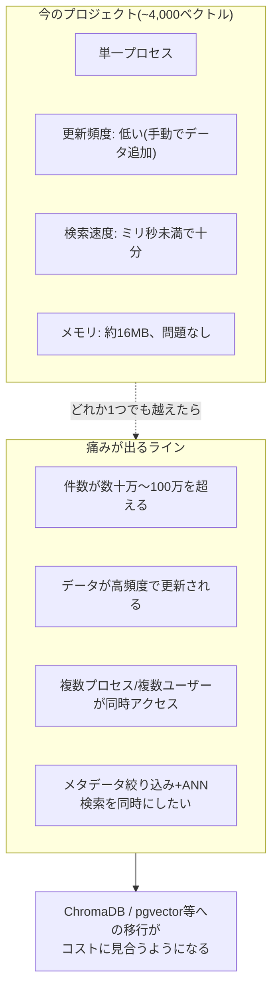

# Vector DBはいつ必要になるか(システムアーキテクチャの観点)

> 「今の規模だとDBなしでもずっといけそう」「vector search/vector DBの必要性がいまいちピンとこない」という状態への回答。
> このプロジェクト固有のデータではなく、一般的なシステム設計の知識として整理する(検証済みの実験結果ではなく、業界標準の目安である点に注意)。

---

## 0. 結論を先に: 「今DBが要らない」のは正しい判断で、"軽いから"ではない

今のプロジェクトが`.cache/`のpickle + Pythonリストの総当たりで問題なく動いているのは、**サボっているからではなく、この規模ではそれが正しい設計だから**。「本当はDBを使うべきだけど手を抜いている」のではなく、「この規模でDBを導入するのは時期尚早(premature)」というのがエンジニアリング的に正確な理解。

重要なのは「DBが要る/要らない」を感覚ではなく**具体的な閾値**で判断できること。これができるかどうかが、初級と中級のApplied AI Engineerの分かれ目になる。以下、閾値を1つずつ具体的に見る。

## 1. 閾値①: 検索速度(ベクトル件数)

**今のプロジェクトの実データ**: LinkedIn Connections(company欄あり)3,723件 + Shares 96件 + レシート171件 ≈ **約4,000ベクトル**。

総当たり(brute-force)コサイン類似度検索は、クエリ1回につき**全ベクトルとの内積計算がO(N)**。1024次元ベクトル4,000件なら、クエリ1回の計算はミリ秒未満〜数ミリ秒。**体感で困るレベルではない**、これが「軽い」の正体。

**一般的な目安**(業界の経験則、このプロジェクトで検証した数値ではない):

| ベクトル件数(N) | 総当たり検索 | 何が起きるか |
|---|---|---|
| 〜数万 | 全く問題なし | ミリ秒オーダー、今のプロジェクトはここ |
| 〜数十万 | まだ許容範囲 | 数十〜数百ミリ秒、UXとしてはギリギリ気になり始める |
| 100万〜 | 問題化し始める | 秒単位、リアルタイム応答が厳しくなる |
| 数百万〜億 | 総当たりは非現実的 | ANN(近似最近傍探索)インデックスが実質必須 |

ChromaDB/pgvectorが使うHNSWのようなANNインデックスは、O(N)ではなく**O(log N)に近い計算量**で近似的な近傍を返す。件数が増えるほど「総当たりとの差」が指数的に開く。**このプロジェクトの4,000件では、HNSWを使っても体感速度はほぼ変わらない**(むしろインデックス構築のオーバーヘッドの方が目立つ可能性すらある)。

## 2. 閾値②: メモリ

1024次元のfloatベクトル1本 ≈ 4KB(float32換算)。

| ベクトル件数 | 概算メモリ |
|---|---|
| 4,000件(今のプロジェクト) | 約16MB |
| 10万件 | 約400MB |
| 100万件 | 約4GB |
| 1,000万件 | 約40GB |

今の実装は`.cache/`のpickleを**プロセスのメモリに全部ロード**する設計。件数が増えてメモリに乗り切らなくなった時点で、ディスクベースのインデックス(DBが担う領域)が必須になる。今の4,000件・約16MBは、この閾値から見ても全く問題にならない規模。

## 3. 閾値③: 更新の粒度(増分更新)

pickleキャッシュは「対象ファイル群全体のハッシュ」がキーなので、**1件でもデータが変わると全件を再計算する**。今のプロジェクトは埋め込み計算が数分で終わる規模だからこれで困らない。

**痛みが出るタイミング**: コーパスが「日次で数百件追加される」ような運用フェーズに入ると、"1件追加するたびに全件(数十万件)を再計算"は非現実的になる。この時点でVector DBのupsert機能(変更があった分だけ更新)が必要になる。**「データが頻繁に変わるか」×「コーパス全体の再計算コスト」の掛け算**で決まる、件数だけの問題ではない。

## 4. 閾値④: 同時アクセス・複数プロセス

今は1プロセスが`.cache/`を読んで自分のメモリに展開するだけなので、複数プロセス・複数ユーザーからの同時書き込みという状況が発生しない(個人プロジェクト、単一プロセス)。

**痛みが出るタイミング**: 複数のアプリインスタンスを立てて負荷分散する、または「データ取り込み処理」と「検索処理」を別プロセスに分ける、といった運用になった瞬間、pickleファイルは「誰が今書き込み中か分からない」「みんな別々にメモリにロードして不整合が起きる」という問題を持つ。DBは複数クライアントからの整合性のあるアクセスを保証する仕組みを最初から持っている。

## 5. 図解: 今のプロジェクトの立ち位置

**このプロジェクトが線を越えていない理由を1つずつ言えること自体が、DBを導入した経験と同じかそれ以上に評価されるポイント**。「動くから使わなかった」ではなく「4つの閾値のどれにも触れていないから今は不要と判断した」と言えるかどうかが違う。

## 6. なぜRAGに関わるなら、この知識自体は避けて通れないのか

「今回のプロジェクトでは要らなかった」と「RAGの実務でVector DBの知識が要らない」は別の話。理由は3つ:

1. **個人プロジェクトの規模は例外的に小さい**。実務のRAGは大抵、社内ドキュメント全体、顧客サポート履歴、法務文書全文など、最初から数万〜数百万chunkの規模で始まることが多い。「4,000件で困らなかった」という経験則はそのまま実務には持ち込めない
2. **"いつ閾値を超えるか"を見積もれること自体が仕事**。データ量が増える前提のプロダクトなら、設計時点で「今は小さいが、半年後に10万件を超える見込みがあるか」を判断し、最初からDBを選ぶべきかを決める必要がある。これは実装スキルというより設計判断力の話
3. **他の技術(ANN、HNSW、pgvectorのインデックス設計)はRAGの標準語彙**。使ったことがなくても、"いつ・なぜ必要になるか"を数字で説明できないと、面接で「素朴なRAGしか知らない人」という印象になりやすい。逆に、今回のように「なぜ使わなくても困らなかったか」を定量的に説明できる方が、Enterprise規模の設計判断ができる証拠として強い

---

## 7. 「最初から考えておくべきこと」 vs 「痛みが出てから決めていいこと」

これは一般的なソフトウェア設計の原則(YAGNI: You Aren't Gonna Need It、ただし完全に無視していい訳ではない)を、この文脈で具体的に言い換えたもの。

### 最初から決めておいた方がいいもの(後から変えるコストが高い)

| 決定事項 | 理由 | このプロジェクトでの実例 |
|---|---|---|
| **Documentのmetadataスキーマ**(何をmetadataとして残すか) | 後から追加するには全件再処理+再埋め込みが必要 | LinkedInの`company`フィールドを最初から残していたから、後でcompanyフィルタを追加できた([daily/2026-08-27.md](../2026-08-27.md)) |
| **埋め込みモデルの選定** | モデルを変えると全ベクトルの再計算が必要、DBのインデックスも作り直し | BGE-M3選定はプライバシー・多言語対応という要件から最初に決めた([daily/2026-08-10.md](../2026-08-10.md)学び⑤) |
| **マルチテナンシー(複数ユーザー対応)の要否** | 後から「1ユーザー前提」の設計をマルチユーザー化するのは大きな改修 | `daily/2026-08-22.md`の「Future TODO」で既に課題として認識済み(他の留学生が自分のデータを使えるようにしたい) |

### 痛みが出てから決めていいもの(後から差し替えやすい)

| 決定事項 | 理由 |
|---|---|
| **検索バックエンド(pickle → ChromaDB → pgvector)** | `build_index()`/`search()`という**安定したインターフェース**の裏側を差し替えるだけで済む。呼び出し側(`router.py`, `chainlit_app.py`)は影響を受けない |
| **top_kやrerankerの有無** | 検索の"精度"のチューニングであって、データ構造自体は変わらない |
| **キャッシュの実装(pickle→Redis等)** | あくまで「計算結果をどこに置くか」の話、計算ロジック自体とは独立 |

**このプロジェクト自体が良い実例になっている**: `build_index(filepaths) -> (split_docs, vectors)`、`search(query, split_docs, vectors) -> results`という関数シグネチャが最初から決まっていたおかげで、内部実装(素朴なリスト total 検索 → pickleキャッシュ追加)を変えても呼び出し側は一切変更していない。**同じインターフェースの裏でChromaDB/pgvectorに差し替えることも、理論上は今すぐでも可能**。「後回しにしていい」と言えるのは、まさにこのインターフェース設計がすでに正しくできているから。

---

## 面接練習用: 1段の言い回し

「私のプロジェクトは現状、レシート・LinkedInデータ合わせて約4,000ベクトルの規模で、総当たりのコサイン類似度検索で十分な速度が出ています。これは手を抜いているのではなく、検索速度・メモリ・更新頻度・同時アクセスという4つの観点で、どれも一般的にVector DBが必要になる閾値(数十万件以上、高頻度更新、複数プロセス同時アクセス等)に達していないことを確認した上での判断です。一方で`build_index`/`search`という安定したインターフェースの裏側は差し替え可能な設計にしてあるので、規模が閾値を超えた時にChromaDBやpgvectorへ移行するコストは低く抑えられます。逆に、metadataスキーマや埋め込みモデルの選定のように、後から変えるコストが高い決定は最初の段階で意識して行いました。」

## 深掘りされた時のフォールバック

- 「具体的にどのくらいの規模になったらDBに移行するか」→ 一般的な目安として数十万件、あるいはコーパスの更新頻度が「日次で総再計算が間に合わない」水準に達した時点、という2つの独立した基準で判断する
- 「ChromaDBを触ったことがないのでは説得力に欠けないか」→ もともとのプランでは`ChromaDB(Week 1-2)→ pgvector(Week 3+)`という移行が予定されている(`files/02_PLAN.md`)。触っていないこと自体は正直に認めた上で、"いつ必要になるか"を数字で説明できる準備があることを示す
- 「HNSWの仕組みは説明できるか」→ グラフ構造で近傍ノードをたどりながら近似的に最近傍を探すインデックス。総当たりのO(N)に対し、検索はO(log N)に近づく。ただし近似(exact ではない)なので、リコール(見逃し)とのトレードオフがある

**元の文脈**: [daily/2026-08-27.md](../2026-08-27.md)(companyメタデータフィルタの実例), [docs/requirements.md](../../docs/requirements.md)(ChromaDB→pgvector移行プラン), [files/02_PLAN.md](../../files/02_PLAN.md)
