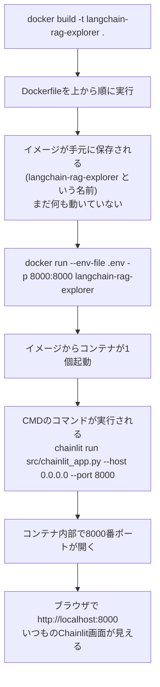

# Docker 101: build→run→ブラウザで見える形、実際の時系列

> `01`の続き。`Dockerfile`は書けたが、実行すると何が起きて、最終的に何が
> 手に入るのかをまだ知らない状態への回。`docs/notes/github-actions-101-tutorial/
> 02_ci_workflow.md`と同じ構成(push→実行の時系列を追う)。

---

## 全体の流れ



## `docker build`時に何が起きるか(Dockerfileを1行ずつ)

1. `FROM python:3.11-slim` → ベースイメージをダウンロード(初回のみ、2回目以降はキャッシュを使う)
2. `WORKDIR /app` → コンテナ内に`/app`というディレクトリを作り、以降の基準にする
3. `COPY requirements.txt .` → `requirements.txt`だけ先にコピー
4. `RUN pip install --no-cache-dir -r requirements.txt` → その場でpip installを実行、
   結果が**イメージの中に焼き固められる**(コンテナを起動するたびにpip installし直す
   必要はない、これが「環境ごと配れる」の実体)
5. `COPY . .` → `.dockerignore`で除外したもの以外、コード全部をコピー
6. `EXPOSE 8000` → 「このイメージは8000番を使うつもり」という宣言だけ(まだ開いていない)
7. `CMD [...]` → 起動時に実行するコマンドを**記録するだけ**。build時点では実行されない

**build完了時点の状態**: `langchain-rag-explorer`という名前のイメージが手元に
保存されている(`docker images`で一覧に出てくる)。**まだ何のプロセスも動いていない**。
冷凍食品ができた状態で、レンジにはまだ入れていない。

## `docker run`時に何が起きるか

1. さっきのイメージから、新しいコンテナが1個起動する
2. `--env-file .env`のおかげで、`.env`の中身(`GEMINI_API_KEY`等)が、
   コンテナ内の環境変数として渡される(イメージ自体には焼き込まれていない、
   `01`で説明した通り)
3. buildの時に記録しておいた`CMD`のコマンド(`chainlit run ...`)が、ここで初めて実行される
4. Chainlitがコンテナ内部で8000番ポートを開いて待ち受け始める
5. `-p 8000:8000`のおかげで、**ホストPC(あなたのMac)の8000番ポート**への
   アクセスが、**コンテナ内部の8000番ポート**に転送される

## 最終的にどう見えるか

ブラウザで`http://localhost:8000`を開くと、**今までターミナルで
`chainlit run src/chainlit_app.py`と打って見ていたのと全く同じChainlitの
チャット画面**が表示される。中身の動作(RAG検索、router、critic、MCP)は
一切変わらない。**変わるのは「Python環境やライブラリを自分のPCに直接
インストールしなくても動く」という点だけ**。

## 確認の仕方

```bash
docker images            # buildしたイメージが一覧に出るか確認
docker build -t langchain-rag-explorer .
docker run --env-file .env -p 8000:8000 langchain-rag-explorer
# 別ターミナルまたはブラウザで:
open http://localhost:8000
```

ターミナルに何かログが流れ続けていれば、コンテナが起動して待ち受けている状態。
`Ctrl+C`で停止できる。
