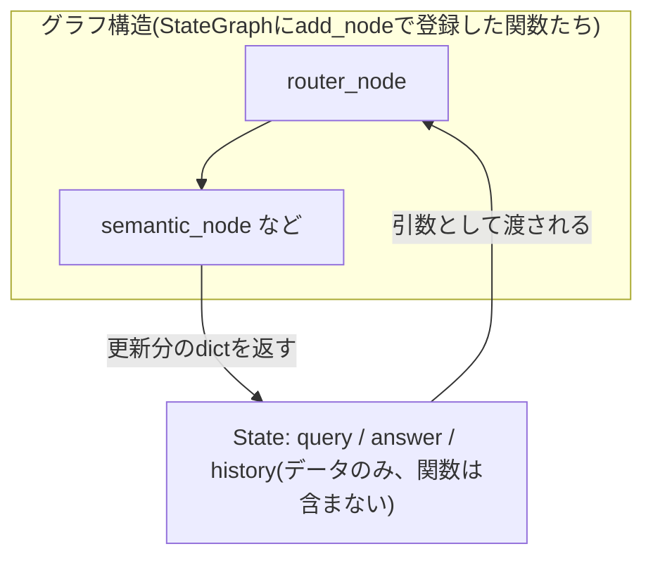
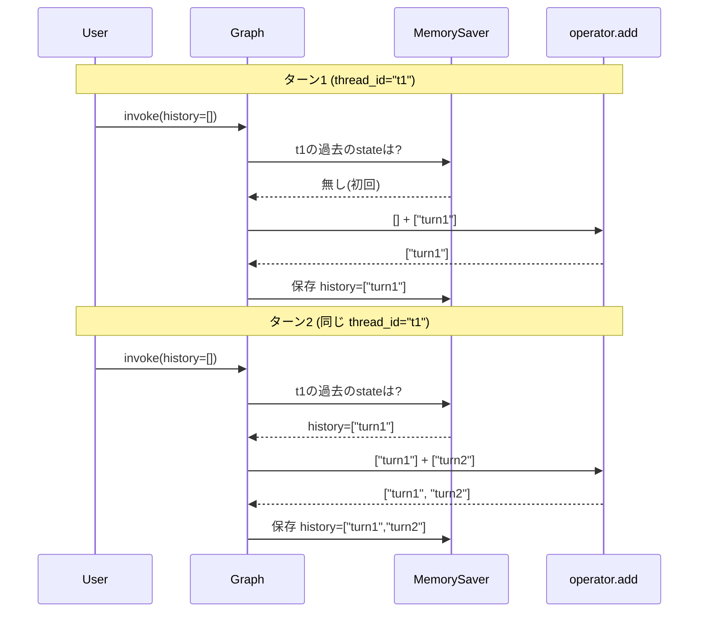

# LangGraph 04: Stateを「蓄積」させる(会話履歴の実現)

> 01/02/03の続き。Issue #21 stage 2(マルチターン・指示語解決)に着手する前に押さえる基礎。

---

## 問題: 普通のStateは「上書き」される

02で使った`MemorySaver`は、`thread_id`が同じなら前回の状態を覚えている、と説明した。ただしこれだけでは、**新しいクエリを渡すたびに、そのキーの中身は上書きされてしまう**。例えば`query`というキーに新しい質問を入れて`invoke`すると、前回の`query`は消えて、新しい質問だけが残る。これでは「前回何を聞かれたか」を覚えられず、会話履歴にならない。

## 解決策: `Annotated[list, operator.add]`で「蓄積」を宣言する

**Input**: Stateのフィールドの型を`Annotated[list, operator.add]`にする
**Output**: ノードが`{"history": [新しい項目]}`のように**リスト1個を返すだけ**で、既存のリストに**自動的に追加(蓄積)**される(上書きされない)
**なぜ**: LangGraphは、State更新のたびに「上書き」か「合成(reducer)」かをフィールドごとに選べる。デフォルトは上書きだが、`Annotated[型, 合成関数]`と書くと、その合成関数(ここでは`operator.add` = リストの結合)を使って前の値と新しい値を合わせる

```python
import operator
from typing import TypedDict, Annotated

class MyState(TypedDict):
    query: str
    history: Annotated[list, operator.add]  # ← ここがポイント

def echo_node(state: MyState) -> dict:
    return {"history": [state["query"]]}  # リスト1個だけ返せば、既存のhistoryに追加される
```

**実際に動作確認した結果**(このプロジェクトのlanggraph==1.2.10で検証済み):
```
1ターン目後のhistory: ['ターン1']
2ターン目後のhistory: ['ターン1', 'ターン2']
```
同じ`thread_id`で2回`invoke`すると、`history`が上書きされず、ちゃんと2件とも残っている。

## Issue #21への接続

これが、指示語(「それぞれ」「その人」)を解決するための土台になる:

1. `history`のようなフィールドに、過去のクエリ・回答を蓄積する
2. `route()`の前に「contextualizeノード」を挟み、`history`を見て今回のクエリの指示語を解決する(具体的な書き方はTODOスキャフォールドで)
3. `thread_id`はChainlitのセッションに対応させる(`cl.context.session.id`等)

## 早見表(01/02の続き)

| やりたいこと | 書き方 |
|---|---|
| Stateのフィールドを「上書き」ではなく「蓄積」させる | `フィールド名: Annotated[list, operator.add]` |
| ノードから蓄積用フィールドを更新する | `return {"フィールド名": [新しい1件]}`(リストごと返さない、1件だけ) |
| 蓄積のたびに何が合成されるか変えたい | `operator.add`の代わりに自作の関数を第2引数に渡せる(今回は不要) |

---

## 補足: 誤解しやすいポイント

### `operator.add`はLangGraph専用の特別な操作ではない

`operator`はPython**標準ライブラリ**のモジュールで、`operator.add(a, b)`は`a + b`と完全に同じもの。LangGraphが独自に用意した合成ロジックではなく、「listの`+` = 結合」という**Pythonの一般的な機能をそのまま流用している**だけ。

```python
import operator
operator.add(["turn1"], ["turn2"])  # => ['turn1', 'turn2']
# ["turn1"] + ["turn2"] と完全に同じ結果になる
```

### Stateは「データの入れ物」であって「関数の入れ物」ではない

**誤解しやすい理解**: 「Stateの中にsemantic/table_displayのような関数(アクション)のリストが入っていて、それが実行される」
→ これは誤り。

**正しい理解**: Stateは`query`/`answer`/`history`のような**データのフィールドだけ**を持つ。関数(`semantic_node`など)はStateの定義には一切登場せず、`StateGraph`に`add_node("名前", 関数)`で**別に**登録される。実行時は、データ(State)がグラフに登録された関数の間を**引数として渡り歩く**だけで、関数自体をStateが保持しているわけではない。ASCII/Mermaidの図で見えるノード名(router/semantic/table_display...)は**グラフ構造側**の話であり、Stateの中身とは別物。



### thread_idでの蓄積は「2層構造」

「1つのスレッドの中で積み上がっていく」というざっくりした理解でOK。正確には2つの別レイヤーが協力している。

| レイヤー | 役割 |
|---|---|
| `MemorySaver` + `thread_id` | **どのスレッドの**過去のstateを復元するか決める |
| `operator.add` | 復元された古いhistoryと今回の新しいhistoryを**どう合成するか**(結合)決める |


