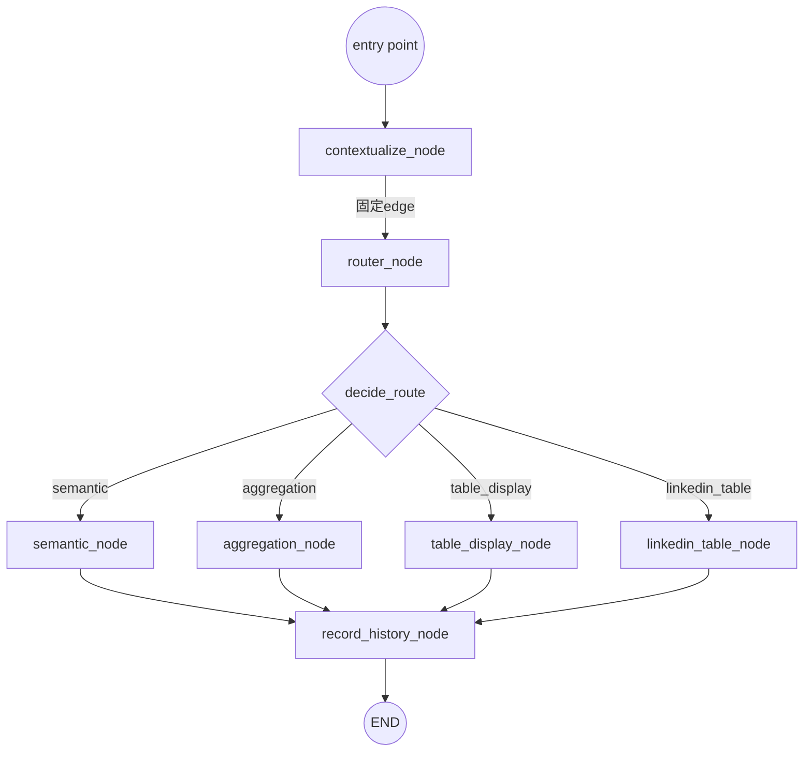
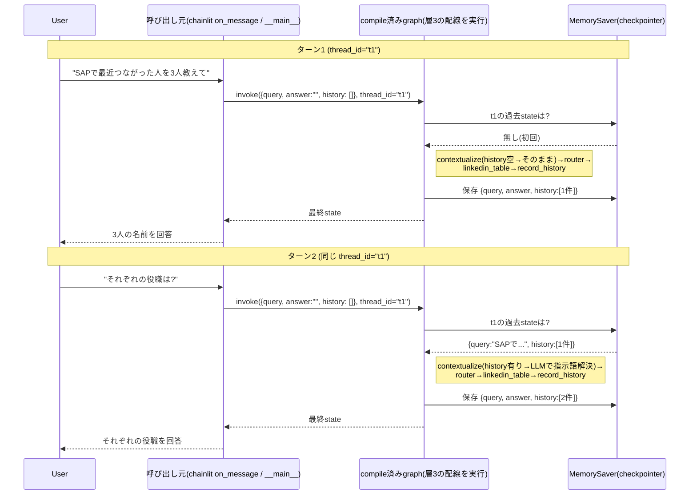
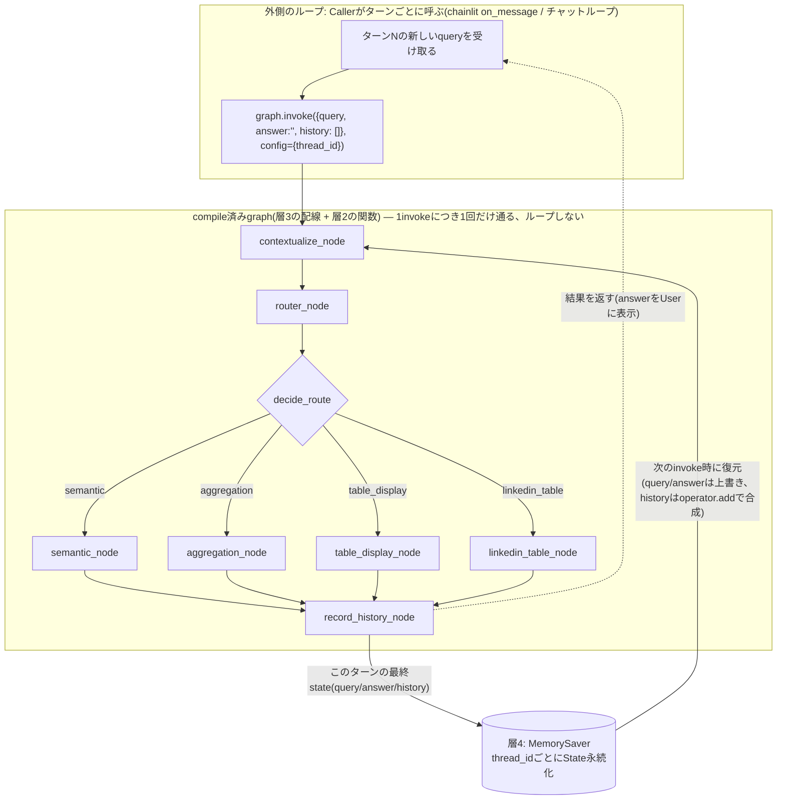

# LangGraph 05: 層ごとに分解して「動きの全体像」を掴む(TODO14前の整理)

> 01〜04の続き。Issue #21 stage 2、TODO14(マルチターン確認)に入る前に、
> 「何が・いつ・どう呼ばれて・stateがどう変わるか」を層(レイヤー)ごとに整理し、
> 最後に1枚の全体図にまとめる。**しばらく間が空いても、このノートだけ読めば復帰できる**ことを目指す。

---

## 大前提: 4つの層がある

`src/graph_router.py`の中身は、実は性質の違う4つの層が積み重なっている。混同しやすいのはここ。

| 層 | 正体 | 変わる/変わらない |
|---|---|---|
| **層1: State** | `RouterState`という**データの型定義**(TypedDict) | ターン内・ターン間で中身が変わる |
| **層2: Node** | `contextualize_node`などの**ただのPython関数** | 定義自体は変わらない(コードとして固定) |
| **層3: Graph構造** | `StateGraph`に`add_node`/`add_edge`で組んだ**配線図** | `build_router_graph()`が呼ばれるたびに組み立てられるが、配線自体は毎回同じ |
| **層4: Runtime** | `compile()`されたgraph + `MemorySaver`(checkpointer) | **これだけが「今どのターンか」を知っている**。thread_idごとにstateを持ち回る |

**よくある誤解の訂正**: 「ノードが今はStateで表されている」わけではない。ノードは今も昔もただの関数(層2)。draw_ascii()やmermaidの図に出てくる四角い箱は、層3(配線図)の中の「ノードという名前の登録エントリ」であって、Stateそのものではない。Stateは層1のデータが層4のRuntimeによって層2の関数の間を運ばれていく、という関係。

---

## 層1: State(データ) — 何を運ぶ入れ物か

```python
class RouterState(TypedDict):
    query: str                              # 上書き型(LastValue) — 毎回最新の値に置き換わる
    answer: str                              # 上書き型(LastValue) — 同上
    history: Annotated[list, operator.add]  # 蓄積型 — 返した分がリストに追記される
```

- `query`と`answer`は「今このターンで何を処理しているか」を表す**一時的な値**。ノードが`{"query": ...}`を返すと、古い値は消えて新しい値に置き換わる。
- `history`だけ特別で、`Annotated[list, operator.add]`のおかげで**過去のターン分がずっと残る**([[04_accumulating_state_for_conversation_history]]参照)。

---

## 層2: Node(関数) — 各ノードが何をするか

全部「`state`(dict)を受け取り、更新したい差分の`dict`を返すだけ」の純粋な関数。呼び出し順は層3が決める。

| Node名 | 読むもの | 返すもの | 役割 |
|---|---|---|---|
| `contextualize_node` | `state["query"]`, `state["history"]` | `{"query": 解決済みクエリ}` | 指示語(「それぞれ」)を`history`を見てLLMで解決し、`query`を**上書き** |
| `router_node` | (何も読まない) | `{}` | conditional edgeの分岐元として置くだけの空ノード |
| `decide_route` | `state["query"]` | 次のノード名(文字列) | ※これはNodeではなく**conditional edgeの判定関数**。`route()`を呼ぶだけ |
| `semantic_node` / `aggregation_node` / `table_display_node` / `linkedin_table_node` | `state["query"]` | `{"answer": ...}` | 既存の`handle_*`を呼んで回答を作る(4つのうち1つだけ実行される) |
| `record_history_node` | `state["query"]`, `state["answer"]` | `{"history": [このターンの1件]}` | このターンのQ&Aを1件、historyに追記する |

---

## 層3: Graph構造(配線) — どの順で呼ぶか



ポイント: **このグラフ自体はループしない**。1回`invoke()`すると、`contextualize`から`END`まで一直線(途中で4択に分岐するだけ)に1回だけ通り、必ず終わる。「ループしてるように見える」のは、層4がこのグラフを**外側から何度も呼び出す**からであって、グラフ構造そのものがループ構造を持っているわけではない。

---

## 層4: Runtime(実行・永続化) — ターンをまたぐ「記憶」の正体



- 「ループ」の正体は**Caller側(chainlitのon_message、あるいは`__main__`で複数回`invoke`を呼ぶコード)が同じ`thread_id`で繰り返し呼んでいるだけ**。
- `query`/`answer`はターンごとに**上書き**されるので前ターンの値は残らないが、`history`だけ`operator.add`のおかげで**Caller側が毎回`history: []`(空リスト)を渡しても**、checkpointerに保存済みの中身と自動的に合成されて消えない。

---

## 全体図(ピースを1枚に)



読み方:
- **内側(Inner)**は層2+層3。何回呼ばれても中身は変わらない、固定の一直線グラフ。
- **外側(Outer)**は層4がCallerと協調して作る「ターンの繰り返し」。ここが体感的な「ループ」。
- **CP(checkpointer)**が2つを繋ぐ記憶装置。`query`/`answer`は毎ターン使い捨て、`history`だけがターンをまたいで積み上がる。

---

## TODO14に入る前のチェックリスト(前回の指摘の再掲)

- [ ] `RouterState`に`history: Annotated[list, operator.add]`が実際に追加されているか(TODO10)
- [ ] `contextualize_node`が`state["history"]`(リスト)を渡しているか、`state["answer"]`ではないか(TODO11)
- [ ] `semantic`/`aggregation`/`table_display`/`linkedin_table`の4つが`END`ではなく`"record_history"`に繋がっているか、`add_edge("record_history", END)`があるか(TODO13)

この3つが揃って初めて、上の全体図の通りに`history`が2ターン目に引き継がれる。
