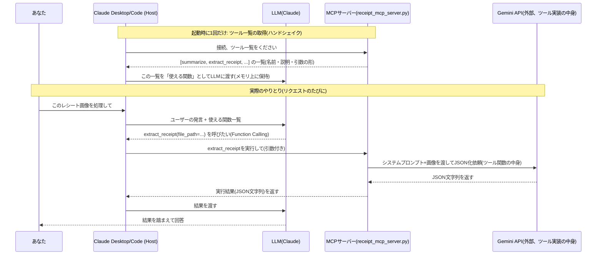

# MCP 101: APIと何が違うのか

> `docs/notes/mcp-101-tutorial/`は、`github-actions-101-tutorial/`と同じ構成の教科書フォルダ。
> `01`は「そもそも何なのか、APIと何が違うのか」を理解するための回。
> 実装(レシートPDF/画像 → JSON化ツールを作る)は`02`以降で扱う予定。

---

## 元々あった誤解: 「MCP = マークダウンに書いた指令書」ではない

MCPサーバーの実体は、APIと同じく**実際に起動するプログラム**(Python/Node.jsなど)。
マークダウンに few-shot の指示を書いておくだけで動く、というものではない。

## 合っていた部分: 「決まった関数しか使えない」はAPIもMCPも同じ

MCPサーバーも「サーバー側が用意した関数(ツール)しか呼べない」という制約はAPIと変わらない。
「相手が用意したものしか使えない」というイメージはMCPにもそのまま当てはまる。

## 本当の違い: 「使い方をどう知るか」が変わる

| | API | MCP |
|---|---|---|
| 中身 | 動くサーバー | 動くサーバー(ここは同じ) |
| クライアントが「何を呼べるか」を知る方法 | 人間がドキュメントを読み、呼び方を1個ずつコードに書く | 接続した瞬間、サーバー自身が「こういう関数がある、引数はこの形式」と機械可読な形で自己申告する。LLMアプリ側は人間が書いた統合コード無しで使える |
| 対応するサービスが増えたら | 増えるたびに人間が新しい統合コードを書く | そのMCPサーバーに繋ぐだけ(統合コードを書き足さなくていい) |

MCPは「APIとは別の新しい能力」ではなく、**「LLMアプリがいろんなAPI的なものに、人間の手作業なしでプラグインできるようにするための、共通の接続規格」**。USBに例えると、APIは機器ごとに違う専用ケーブル、MCPは「USB-Cという規格に揃えれば、どの機器でも同じ挿し口で繋がる」という話に近い。

## MCPが実際に提供する3つの機能

1. **Tools(ツール)**: 呼び出せる関数。APIのエンドポイントに一番近い。今回のレシート自動化(PDF/画像 → JSON)はここに当たる
2. **Resources(リソース)**: LLMが読めるデータ(ファイル、DBの行など)
3. **Prompts(プロンプト)**: サーバー側があらかじめ用意した定型プロンプトのテンプレート。**元々の「マークダウンにfew-shotで指示を書いておく」というイメージは、実はここに一番近い**が、MCPの3機能のうち1つに過ぎず、MCPの本質(1・2)とは別物

## 全体の流れ(システムダイヤグラム)

「ツール一覧がメモリ上に並んでいて、function callingで選ばれたものをMCPが実行しに行く」という理解は**おおむね合っている**。1点だけ補正: 最後にGemini(外部API)を呼んでいるのは「MCP」ではなく「MCPが実行した、あなたが書いたPython関数の中身」。MCPの役割は「どのツールを実行するか仲介するところまで」で、その先で何のAPIを叩くかは完全にツール実装側の自由(今回はGemini、Google Mapsツールなら地図APIを叩く、という具合)。



「Google Mapsも出せるようにしたい」という例で言うと、`extract_receipt`と同じ形で`search_place`のようなツールをこの`receipt_mcp_server.py`(または別のMCPサーバー)に追加登録すれば、上の一覧に`search_place`も並ぶようになる。LLMがユーザーの発言から「地図の話だ」と判断すれば`search_place`を、「レシートの話だ」と判断すれば`extract_receipt`を選ぶ、という仕組み。

## `.mcp.json`の役割: 「毎回の通り道」ではなく「起動時に1回読む設定」

チャットで話しかけるたびに`.mcp.json`に何かが伝わる、という動きではない。`.mcp.json`は**起動時に1回だけ読まれる設定ファイル**で、そこに書いたコマンドでMCPサーバーのプロセスを実際に立ち上げ、ツール一覧を取得するところまでがその役目。

```
[起動時、1回だけ]
Claude Codeが .mcp.json を読む
  → 書いてあるコマンド(.venv/bin/python src/receipt_mcp_server.py)で
    receipt_mcp_server.pyのプロセスを実際に立ち上げる
  → そのプロセスに「持ってるツール一覧を教えて」と聞く
  → 一覧(extract_receiptなど)をClaude Codeの中に保持しておく
  → 初めて見るMCPサーバーの場合、ここで「使いますか?」の確認が入る
    (`claude`起動時に出た、あの選択肢はこれ)

[チャットで話しかけるたび]
あなたが自然言語で話しかける
  → Claude(LLM)が、起動時に保持しておいたツール一覧を見て
    「これはextract_receiptを使うべきだ」と判断する
  → Claude Codeが、起動済みのreceipt_mcp_server.pyのプロセスに
    直接「extract_receiptを呼んで」と送る(.mcp.jsonを都度読み返すわけではない)
  → プロセス内でGeminiが呼ばれてJSONが返る
  → 結果がClaude Codeに戻り、それを踏まえて返答する
```

`.mcp.json`は「開店準備(どの店をどうやって開けるか書いた紙)」、実際の注文のやりとりは開店後の**お店(起動済みのプロセス)に直接**行われる、というイメージ。

## 教訓: 「構文的に正しいこと」の保証をLLMの自然言語処理に任せない

実際にレシート3枚を処理してみて出てきた教訓。JSONへの追記(既存配列を読み込み、新しい要素を足し、書き出す)を、システムプロンプトで「最後のカンマを外して繋げてください」のようにLLMの自然言語処理に頼ろうとしたが、これはお勧めしない、という結論になった。

理由: LLMは「だいたい正しい構文」は書けるが、「100%機械的に正しい構文」は保証できない。実際、同じ回の抽出でも`&amp;`のデコード漏れや、品目の価格の誤読(ぶどう糖0.85€を1.70€と誤読)が起きた。これは画像認識(OCR相当)の精度の話だが、**JSON構文の組み立て(カンマ・括弧の位置)も同じ「LLMの自由記述」というカテゴリに属する**、という点では同じリスクを持つ。

**どこまでLLMに任せて、どこからコードに渡すべきか**、という線引きの実例:

| 作業 | 誰がやるべきか | 理由 |
|---|---|---|
| 画像からの情報抽出(店名・価格・品目) | LLM(Gemini) | ここはLLMにしかできない(画像認識) |
| 抽出結果の整合性チェック(品目合計=total_eurか) | コード(assert) | 機械的に判定できることは機械にやらせる |
| JSONファイルへの追記・保存 | コード(`json.load`→`list.append`→`json.dump`) | 構文の正しさは100%保証されるべきで、LLMの自然言語処理に依存させるべきではない |

MCPツールを設計する時も同じ発想が使える: **「LLMでないと出来ないこと」だけをLLM呼び出しにして、「機械的に確実にやるべきこと」は普通のコードとして書く**、という役割分担がMCPツールの中身の設計方針になる。

## 今回作るもの

レシートPDF/画像 → 構造化JSON、という関数を1つ、Toolsとして公開するMCPサーバーを作る。
「マークダウンの指示書」ではなく、`src/embedding_quality_test.py`と同じように実際に動くPythonコードを書く。
