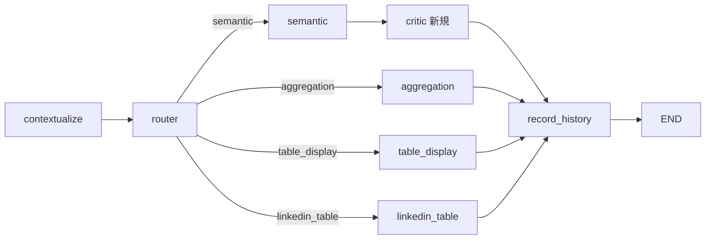

# Multi-Agent 101: criticノードの設計(実装編)

> `01`の続き。「なぜ1つのcriticノードだけを追加するのか(3分割はしないのか)」は
> `01`末尾の評価表を参照。ここでは実際の設計とワイヤリングを扱う。
> TODOスキャフォールドは`src/graph_router.py`に直接追加した(TODO 15〜16)。

---

## スコープ: `semantic`ブランチの後ろにだけ挿入する

`semantic`だけがRAG検索結果を根拠にLLMが自由記述で回答を組み立てるブランチで、幻覚(根拠のない内容を書く)のリスクが一番高い。他の3つはpandasの集計・表示が中心で、LLMの自由記述部分が少ない(または無い)ため、今回はcritic対象から外した。

## criticノードの設計

**Input**: `state`(`query`=質問、`answer`=semantic_nodeが生成した回答)
**Output**: `dict`。`{"answer": 検証後の回答}`
**なぜ**: `01`の理由2の通り、生成した本人(同じ文脈)に自己採点させるより、別の呼び出しでチェックさせる方が、生成時の思い込みに引きずられにくい

今回は**retryループにしない**(criticが「ダメ」と判定したら`semantic_node`に戻ってやり直す、という設計にはしない)。理由: ループは「無限に回り続ける」リスクと実装の複雑さを増やす割に、月曜までのスコープでは過剰。今回は「問題があれば注記を付けて返す」という、一番小さく確実な形にする。

## `RouterState`は変更不要

`query`と`answer`は既にあるので、criticノードは`answer`を読んで`answer`を書き換えるだけ。新しいフィールドは要らない。

## ワイヤリングの変更点(既存コードへの影響は最小)

- `graph_builder.add_node("critic", critic_node)` を追加
- `graph_builder.add_edge("semantic", "record_history")` を `add_edge("semantic", "critic")` + `add_edge("critic", "record_history")` に差し替え
- `aggregation`/`table_display`/`linkedin_table`の3本は変更しない

## 動作確認の仕方

`semantic`ブランチに来る質問(例: 「DeepLのVPは?」)を投げて、`graph.stream(...)`の出力に`critic`ノードの実行ログが挟まっていることを確認する。意図的に根拠の薄い質問(コーパスに無い人物について聞く、など)を投げてみて、`⚠️ 検証:`のような注記が付くかも試してみるとよい。
