# Multi-Agent 101: semanticに入ってからcriticを抜けるまでの詳細フロー

> `03`で話した「groundedness」が、実際のコードのどこで何が渡されて成立しているかを、
> 関数呼び出しレベルで図にする。`router`が"semantic"を選んだ直後から、
> `record_history`→`END`(このターンの終わり)まで。

---

```mermaid
flowchart TD
    A["router (decide_route)<br/>Input: state.query<br/>Output: 'semantic' を選択"] --> B

    subgraph SN["semantic_node"]
        direction TB
        B["handle_semantic(query, collection, llm) を呼ぶ"] --> C
        C["_match_known_companies(query)<br/>_match_known_initials(query)<br/>Input: 元のquery文字列<br/>Output: 会社名/initialsが<br/>クエリに含まれているか"] --> D
        D["company/initialsの有無から<br/>ChromaDBのwhereフィルタを組み立てる<br/>(例: company='SAP'に絞る、など)"] --> E
        E["search(query, collection, top_k=5,<br/>use_rewriting=True, llm, where)<br/>① 1回目: expand_query_to_definitionで<br/>&nbsp;&nbsp;queryを検索向けに書き換え(Query Rewriting)<br/>② 2回目: 書き換え後のqueryをembedし、<br/>&nbsp;&nbsp;whereフィルタ付きでChromaDBに問い合わせ<br/>Output: search_results = [(score, doc), ...]<br/>(doc.page_content=chunk本文, doc.metadata=出典)"] --> F
        F["generate_answer(query, search_results, llm)<br/>Input: 元のquery + search_results<br/>Output: answer(自然文の回答)"]
    end

    F --> G["semantic_nodeの戻り値組み立て<br/>retrieved_context = search_resultsの<br/>doc.page_contentを全部連結した文字列<br/>Output(stateへ書き込み):<br/>{'answer': answer, 'retrieved_context': retrieved_context}"]

    G --> H["critic_node<br/>Input: state.query, state.answer,<br/>&nbsp;&nbsp;state.retrieved_context<br/>処理: 'answerの内容はretrieved_contextに<br/>&nbsp;&nbsp;書かれている範囲に収まっているか'をllmに確認させる<br/>Output(stateへ書き込み):<br/>{'answer': 検証後の回答<br/>&nbsp;&nbsp;(根拠不足なら⚠️注記が先頭に付く)}"]

    H --> I["record_history_node<br/>Input: state.query(解決済み), state.answer(検証後)<br/>Output: {'history': ['Q: ...\\nA: ...']}<br/>(historyに1件追加、次ターンの<br/>&nbsp;&nbsp;contextualize_nodeが使う)"]

    I --> J["END<br/>このターンの最終state(query/answer/history/<br/>&nbsp;&nbsp;retrieved_context)がcheckpointerに保存される"]
```

## ポイント: `retrieved_context`は`handle_semantic`の中で1回だけ作られ、そのままcriticまで運ばれる

- `search()`が返す`search_results`(=検索でヒットしたchunk本体)は、**`generate_answer()`が回答を書く時の材料**であると同時に、**`retrieved_context`としてそのままcriticにも渡される**、という「同じデータを2箇所で使う」構造になっている
- criticは新たに検索をやり直したりはしない。**semanticが実際に見た検索結果と全く同じもの**を見て照合するので、「回答生成時には見えていたのに、検証時には違うデータで判定してしまう」というズレが起きない
- `aggregation`/`table_display`/`linkedin_table`の3ブランチは`retrieved_context`を書き込まないので、そのまま(criticを経由せず)`record_history`に直接進む(`02`の設計通り)
