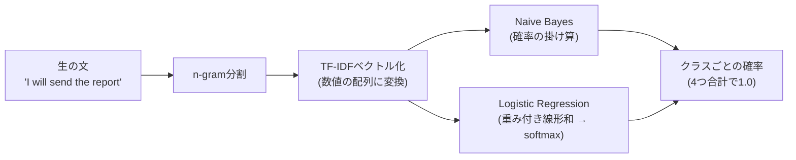

# NB・LRが「ゼロから」特徴量を作り、分類するまでの数式

> `docs/speech-act-baseline-primer.md`の3節(教科書的な説明)をもっと具体的にした版。
> Amazon ML Universityのように、定義→式→小さい具体例、の順で1つずつ潰す。
> ゴールは「LRは2値(spam/ham)しか覚えてない」を「4クラスでも同じ数式の自然な拡張」
> に更新すること。

---

## 0. 全体のパイプライン



NBもLRも、**入力は同じTF-IDFベクトル**。違うのは「そのベクトルからクラス確率を
どう計算するか」という後半部分だけ。

---

## 1. N-gram: 文をどう切り出すか

**定義**: 隣接するn個の単語(または文字)のまとまり。

例文: `"I will send the report"`

| n | 呼び方 | 切り出した結果 |
|---|---|---|
| 1 | unigram | I / will / send / the / report |
| 2 | bigram | "I will" / "will send" / "send the" / "the report" |

今回のコード:
```python
TfidfVectorizer(ngram_range=(1, 2), min_df=2)
```
`ngram_range=(1, 2)`は「unigramとbigram両方を特徴量にする」という意味。
`min_df=2`は「学習データ全体で2文書未満にしか出現しない単語/bigramは捨てる」
(1回しか出ない特徴量はノイズになりやすいので、事前に間引く)。

**なぜbigramも要るか**: unigramだけだと語順の情報が一部失われる。例えば
"not good"(bigram)と、"not"・"good"をバラバラに見た場合とでは、後者は
「良い」というポジティブな単語が単独で残ってしまう。bigramを足すことで、
隣接2語のパターンだけは拾えるようになる(ただし3語以上離れた依存関係は
今回の手法では原理的に拾えない、これが後で出てくる「語順を落とす」限界の話)。

---

## 2. TF-IDF: 単語をどう数値にするか

**TF(Term Frequency)**: その文書の中で、その単語がどれだけ出てきたか

$$
TF(t, d) = \frac{\text{文書}d\text{における単語}t\text{の出現回数}}{\text{文書}d\text{の総単語数}}
$$

**IDF(Inverse Document Frequency)**: その単語が、コーパス全体でどれだけ「珍しい」か

$$
IDF(t) = \log\left(\frac{N}{df(t)}\right)
$$

$N$ = 全文書数、$df(t)$ = 単語$t$を含む文書の数。

**TF-IDF** = 両方を掛け合わせる

$$
TFIDF(t, d) = TF(t, d) \times IDF(t)
$$

### 小さい具体例

3文だけのミニコーパスで計算する:

1. "I will send the report"
2. "Please send the report"
3. "The weather is nice today"

単語"send"について:
- 文書1・2に出現、文書3には出現しない → $df(\text{send}) = 2$、$N = 3$
- $IDF(\text{send}) = \log(3/2) \approx 0.405$
- 文書1では5単語中1回出現 → $TF(\text{send}, d_1) = 1/5 = 0.2$
- $TFIDF(\text{send}, d_1) = 0.2 \times 0.405 \approx 0.081$

単語"the"について:
- 全3文書に出現 → $df(\text{the}) = 3$
- $IDF(\text{the}) = \log(3/3) = \log(1) = 0$
- **IDFが0になる = TF-IDFも必ず0になる**。「どこにでも出る単語は、TF-IDF上は
  情報を持たない(重み0)」という直感がそのまま数式に出ている

---

## 3. Naive Bayes: 確率の掛け算でクラスを選ぶ

**ベイズの定理**:

$$
P(\text{class} \mid \text{words}) = \frac{P(\text{words} \mid \text{class}) \, P(\text{class})}{P(\text{words})}
$$

分類では「どのclassが一番もっともらしいか」の**比較**だけできればいいので、
全classで共通の分母$P(\text{words})$は無視して良い:

$$
P(\text{class} \mid \text{words}) \propto P(\text{class}) \prod_{i} P(word_i \mid \text{class})
$$

「naive」= 各単語の出現が、classが分かっている前提のもとで**互いに独立**と仮定する
(文法的には明らかに嘘だが、これのおかげで計算が単語ごとの掛け算だけで済む)。

**実装上の注意**: 確率同士をそのまま何十個も掛け算すると、数値が小さすぎて
コンピュータの精度で0になってしまう(アンダーフロー)。なので実際は対数を取って
足し算にする:

$$
\log P(\text{class} \mid \text{words}) \propto \log P(\text{class}) + \sum_i \log P(word_i \mid \text{class})
$$

### 小さい具体例

"send"という単語が、学習データ中でcommissiveの発話に3回、directiveの発話に1回
出てきたとする(仮の数字)。単純化して2クラス、1単語だけで比較すると:

- $P(\text{send} \mid \text{commissive}) = 3/(\text{commissive全単語数})$
- $P(\text{send} \mid \text{directive}) = 1/(\text{directive全単語数})$

"send"という単語1つだけ見れば、commissiveの方に出やすい、という情報になる。
実際は"send"だけでなく、その文に含まれる**全単語(またはbigram)の対数確率を
全部足し合わせて**、4クラス分のスコアを計算し、一番大きいものを選ぶ。

---

## 4. Logistic Regression: 線形結合を確率に変換する

### 4a. 2値の場合(spam/hamで覚えている形)

$$
z = \mathbf{w} \cdot \mathbf{x} + b
$$

$\mathbf{x}$ = TF-IDFベクトル、$\mathbf{w}$ = 学習される重みベクトル(各単語ごとに1個)、
$b$ = バイアス項。$z$は「spamらしさの生スコア」で、$-\infty$から$+\infty$まで
どんな値も取りうる。これを0〜1の確率に変換するのがsigmoid関数:

$$
\sigma(z) = \frac{1}{1 + e^{-z}}
$$

```
確率
1.0 |                    ______
    |                 /
0.5 |- - - - - - - -+- - - - - -
    |            /
0.0 |______/
    +------------------------------ z
         -4   -2    0    2    4
```

$z=0$のとき$\sigma(z)=0.5$(ちょうど閾値)、$z$が大きいほど1に、小さいほど0に
近づく。「0.5より大きければspam、そうでなければham」というのが、あなたが
覚えている2値の閾値判定。

### 4b. 4クラスへの一般化(softmax regression) — ここが記憶から抜けていた部分

2値の場合、重みベクトル$\mathbf{w}$は1本だけだった(「spamらしさ」の方向を
1本の直線で表せば十分だったから)。**4クラスでは、クラスごとに専用の重みベクトルを
1本ずつ、計4本用意する**:

$$
z_k = \mathbf{w}_k \cdot \mathbf{x} + b_k \quad (k = \text{inform, question, directive, commissive})
$$

4つのスコア$z_1, z_2, z_3, z_4$が出たら、それをsoftmax関数で確率に変換する:

$$
P(\text{class}=k \mid \mathbf{x}) = \frac{e^{z_k}}{\sum_{j=1}^{4} e^{z_j}}
$$

分母が「4クラス全部のスコアの指数を足したもの」なので、**4つの確率を足すと
必ず1.0になる**。「0.6を超えたらcommissive」のような、クラスごとに独立した
閾値判定を4回繰り返しているのではなく、**4つのスコアを同時に比較して、一発で
一番大きいものを選ぶ**、という形になっている。

**sigmoidとsoftmaxは別物ではない**: 実はクラス数が2の時、softmaxの式を展開すると
sigmoidの式に一致する(2クラス分のスコア$z_1, z_2$の差だけが効いてくるように
変形できる)。つまり**sigmoid(2値ロジスティック回帰)は、softmax(多クラス
ロジスティック回帰)のクラス数=2という特殊ケース**。「spam/hamで覚えている式」と
「4クラスで使っている式」は、実は同じ式の一般形と特殊形の関係にある。

### 今回のコードとの対応

```python
LogisticRegression(max_iter=1000, class_weight="balanced")
```

`multi_class`を明示的に指定していないが、4クラスかつ`lbfgs`(デフォルトsolver)を
使う場合、scikit-learnは自動でmultinomial(=softmax)方式を使う。**One-vs-Rest
(クラスごとに独立な2値分類器を4個作る方式)ではない**、という点が今回の
「誤解1」の答えの数式的な根拠。

---

## 5. NBとLRの数式レベルでの違い、まとめ

| | Naive Bayes | Logistic Regression |
|---|---|---|
| 何を学習するか | $P(word \mid class)$(単語の生成確率) | $\mathbf{w}_k, b_k$(クラスごとの重み) |
| クラス確率の出し方 | 確率の掛け算(対数では足し算) | 線形結合 → softmax |
| 単語間の関係 | 独立と仮定(naive) | 仮定しない、重みの学習で自然に反映される |
| 数式のタイプ | 生成モデル(class → wordsの過程をモデル化) | 識別モデル(words → classを直接モデル化) |

---

## 参考

- Amazon ML University: "Machine Learning Accelerator" のNLP/分類の講義が、
  この式展開(特にNaive BayesのMAP推定、Logistic Regressionのsoftmax一般化)を
  同じ順序で扱っている
- `docs/speech-act-baseline-primer.md`(この文書の前段、言語学的な背景)
- `daily/interview-prep/speech-act-baseline-report.md`(実際の結果とCLとの接続)
