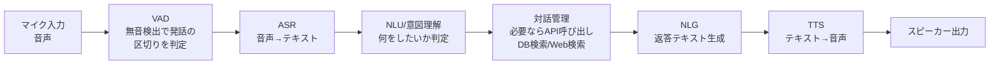
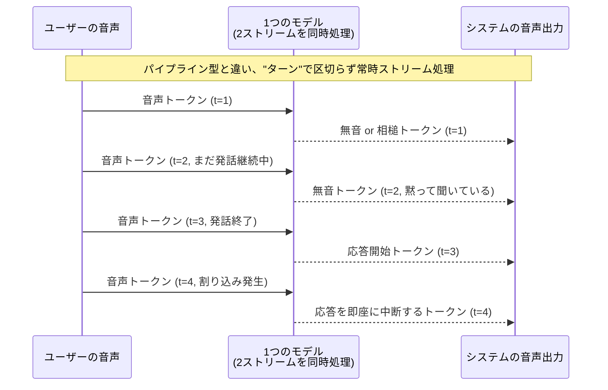

# 音声対話システム: 「パイプライン型」と「フルデュプレックス型」の違い

> 2026-09-30〜10-01の議論から。自分の頭の中にあったイメージ
> (「音声→テキスト化→処理→APIを呼ぶ→テキスト生成→音声に戻す」)は
> 実在する1つの方式(パイプライン型)で、合っている。
> ただしそれは「RAGに音声の皮をかぶせただけ」になりやすく、
> もう1つ、本質的に別の作り方(フルデュプレックス型/エンドツーエンド型)がある。
> この2つの違いを区別できるかどうかが、今回の軸2候補の「新しさ」の分かれ目になる。

---

## 1. パイプライン型(自分がイメージしていたやつ、Siri/Alexaもこれ)

質問に対して返す、を1ターンずつ順番にこなす方式。各段階が別々のモデル/モジュール。

- **ターンの区切り方**: 無音(silence)が一定時間続いたら「発話が終わった」とみなすだけ。VADという、音量ベースの単純な仕組み。
- **割り込み(barge-in)への対応**: 基本的に「ユーザーが喋り始めたらTTS再生を止める」程度。システム側が相手の発話の**内容**を理解しながら喋り続けるかどうかを判断しているわけではない。
- **代表例**: Siri, Alexa, Google Assistant、そして今作っている`graph_router.py`に音声の入出力をつけただけのもの。
- **弱点**: 各段階を順番に通るので遅延が積み重なる。無音待ちのせいで「気まずい間」が生まれる。相手の発話途中に相槌(「うん」「へえ」)を打つような自然さが原理的に出せない。

**これが「RAGの延長(自己満)になりがち」と言われる理由**: テキストの対話システムの前後に音声入出力(ASR/TTS)を貼り付けているだけで、対話そのものの設計(`contextualize_query`や`critic_node`)は今のRAGと同じ骨格のまま。新しい技術的挑戦は「ASR/TTSのAPIを呼ぶ」という接続作業がほとんどになる。

---

## 2. フルデュプレックス型/エンドツーエンド型(Moshiなど、こちらが本質的に新しい)

音声を「一度テキストに変換してから処理する」のではなく、**音声そのものを連続的なトークン列として扱い、1つのニューラルネットが「聞きながら話す」を同時にこなす**方式。

### 仕組みのポイント

1. **音声のトークン化**: テキストが「サブワードトークン」に分割されるのと同じ発想で、音声も専用のニューラルコーデック(例: Moshiが使うMimi)によって離散的な「音声トークン」の列に変換される。これにより音声も言語モデルと同じ「次のトークンを予測する」仕組みで扱えるようになる。
2. **2本のストリームを同時に処理**: モデルは「自分が今聞いている音声トークンの流れ」と「自分がこれから発する音声トークンの流れ」を、**同じタイムステップで並行して**処理する。これが「フルデュプレックス(全二重)」と呼ばれる所以。電話回線が送信と受信を同時にできるのと同じ比喩。
3. **ターンテイキングは「学習された振る舞い」**: 無音検出のような固定ルールではなく、モデル自身が「今は黙って聞くべきか」「相槌を打つべきか」「話し始めるべきか」を、学習済みの重みの中で判断する。だから理屈上は、相手がまだ喋っている途中でも自然に割り込んだり、逆に黙って最後まで聞いたりできる。

- **代表例**: Kyutai社のMoshi(オープンソース)、GPT-4o音声モード(クローズド)。
- **既存知識との接続点**: 外部情報(今日の天気、DBの中身)が必要な質問には、結局どこかでツール呼び出し/検索が必要になる。ここに今のRAGの知識がそのまま活きる(= "Moshi-RAG"のような組み合わせが研究されている)。つまり**接続点はあるが、対話の中核(ターンの取り方そのもの)は完全に別物**。

---

## 3. なぜ「軸1の延長」とは言い切れないのか

| 観点 | パイプライン型 | フルデュプレックス型 |
|---|---|---|
| 対話の中核設計 | 既存RAGと同じ(ターンごとにテキストで処理) | 音声トークンのストリーム処理という別パラダイム |
| ターンの決め方 | 無音検出という固定ルール | モデルが学習した振る舞い |
| 新規に学ぶ技術 | ASR/TTS APIの繋ぎ方(統合作業寄り) | 音声トークン化・ストリーミング生成・全二重処理(モデリング寄り) |
| 「自己満」になりやすいか | なりやすい(既存スキルの再利用が大半) | なりにくい(モデルの中身の理解が要る) |

結論: **ユーザーが心配していた「結局RAGに戻るだけ」という懸念は、パイプライン型を選んだ場合には正しい**。フルデュプレックス型を選べば、対話管理の中核部分が本当に別の技術になる。

---

## 4. ターンテイキング以外に、この分野で研究されていること

「ターンテイキング以外にも調べたい」という要望に対応。フルデュプレックス音声対話の研究コミュニティで扱われている主なサブ課題:

- **バージイン処理(barge-in handling)**: ユーザーが割り込んできた時に、システムの発話をどこで・どう止めるか
- **相槌生成(backchanneling)**: 「うん」「へえ」のような、相手の発話を遮らない短い反応をいつ・どう生成するか
- **ストリーミング生成の低遅延化**: 音声トークンを1つずつ生成しながら、聞き手が待たされていると感じない速さを保つ
- **複数話者の聞き分け**: 会話に複数人が参加している場面で、誰が今話しているかをリアルタイムに扱う(speaker diarizationと接続する領域)
- **生成音声の感情・韻律制御**: 返答のトーンや抑揚を状況に応じて変える
- **ツール呼び出しとの統合**: フルデュプレックスの会話ループの中に、外部API呼び出し(検索・DB参照)をどう割り込ませるか(Moshi-RAG的な研究)

次のファイル([02_task_types_and_ml_transfer.md](02_task_types_and_ml_transfer.md))で、これらを「機械学習としてどこまで音声以外(画像・動画)に汎用化できるか」という軸で整理する。
