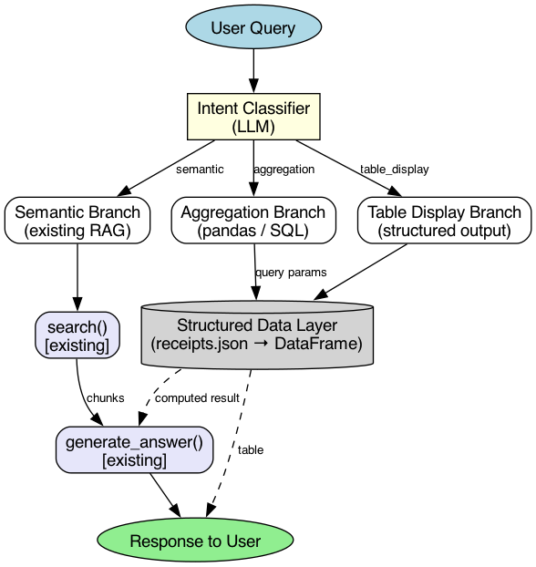

# Router-Type RAG Design Sketch

## Overview

### Problem

既存アプローチ(素朴な RAG、Query Rewriting + top_k 調整)では、集計クエリがうまくいかなかった。ドキュメント数が増えていくと top_k の調整だけでは対応しきれなくなるため、Router が必要だと判断した。

LLM はそもそも集計計算が苦手。SQL やテーブルのようにあらかじめ構造化データとして定義できるものは、先に構造化データ層(DataFrame / DB)として用意しておいた方が精度も上がり、LLM に全件読ませるより消費トークンも抑えられる。

実際に Query Rewriting + top_k 調整を行い、全 Docs を retrieval に含めても、各レシートの件数が実際の値と食い違い、せっかくメタデータを持たせていたのに合計金額も大きくズレた。Day 10 の全10ヶ月コーパス(171 receipts, 1474.55 EUR)で aggregation query を検証した結果、retrieval 改善だけでは集計問題は解けないことが実データで確定した:

- **Retrieval bottleneck** (top_k=50): LLM 回答の合計がぴったり top_k と一致、chunk 数上限が集計精度を頭打ちにする
- **Arithmetic bottleneck** (top_k=all=171): 全件見えても月別グルーピングを 10ヶ月中 9ヶ月で誤答、合計金額は systematic に +162 EUR 過大

結論: 意味検索(semantic retrieval)と集計計算(deterministic aggregation)は別レイヤーで扱う必要がある。単一パイプラインで両方を LLM に任せる設計には原理的な限界がある。

### Solution: Intent-based Routing

Query を intent で3分類し、それぞれ適した処理層にディスパッチする Router 型 RAG を導入する。aggregation / table_display 系は構造化データ層(pandas / SQL)をあらかじめ用意しておくことで、集計のたびに全件を LLM に読ませる必要がなくなり、消費トークンも抑えられる。

### Data Flow

`docs/diagrams/router-overview.dot` に DOT source を配置。レンダリング済み画像は `docs/diagrams/router-overview.png`。



### Three Branches (概要)

| Intent | 例 | 処理層 |
|---|---|---|
| `semantic` | "Neo-Gricean implicature とは?" | 既存 RAG(embedding retrieval + LLM generation) |
| `aggregation` | "4月の合計支出は?" | 構造化データ層(pandas / SQL)+ LLM で自然文整形 |
| `table_display` | "全レシート一覧を表で" | 構造化データ層 → 表形式で直接出力 |

---

## Design Details

### Intent Classification

Query を3つの intent のいずれかに分類する仕組み。3つの実装 option を検討した:

- **Option A: LLM ベース** (Gemini Flash に system prompt で分類させる)
  - Pro: 柔軟、表現ゆらぎに強い、edge case 対応が容易
  - Con: 追加の LLM 呼び出しで latency + cost が増える

- **Option B: Rule ベース** (keyword マッチ、regex)
  - Pro: 高速、決定的、cost ゼロ
  - Con: 表現ゆらぎに弱い、キーワードリストの maintenance 負担

- **Option C: Hybrid** (まず rule で明確なものを分類、曖昧なもののみ LLM にフォールバック)
  - Pro: 大半の cost/latency を抑えつつ柔軟性も確保
  - Con: 実装複雑度が上がる、2 段階の tuning が必要

**Phase 1 の選択: Option A** で開始。理由は Yamato の corpus 規模ではまだ latency/cost が実務的問題にならず、実装がシンプルで検証速度を優先できるため。精度と latency を計測した上で、Phase 2 で Option C への移行を検討する。

### Branch Contracts

各 branch の I/O 契約:

```python
def route(query: str) -> Literal["semantic", "aggregation", "table_display"]:
    """Query を intent 3分類にディスパッチ"""
    ...

def handle_semantic(query: str, split_docs: list, vectors: list, llm) -> str:
    """既存 rag_pipeline を呼ぶ。retrieval + generation の従来経路"""
    ...

def handle_aggregation(query: str, df: pd.DataFrame, llm) -> str:
    """pandas で集計 → LLM で自然文整形"""
    ...

def handle_table_display(query: str, df: pd.DataFrame) -> str:
    """構造化データを Markdown table として直接返す(LLM を通さない)"""
    ...
```

Router 層は上記4関数を薄く束ねる wrapper として実装:

```python
def router_answer(query: str, split_docs, vectors, df, llm) -> str:
    intent = route(query)
    if intent == "semantic":
        return handle_semantic(query, split_docs, vectors, llm)
    elif intent == "aggregation":
        return handle_aggregation(query, df, llm)
    elif intent == "table_display":
        return handle_table_display(query, df)
```
### Table Display Branch の位置づけ

一般的には aggregation 経由で構造化された結果を表示する順序が自然だが、
本プロジェクトでは Yamato 自身の生活記録を「一覧として眺める」用途を first-class
と位置づけ、build_index の load 段階で DataFrame を事前構築する設計を採用する。
これにより table_display branch は runtime で `df.to_markdown()` を返すだけで済み、
LLM を通さないため件数・金額のズレが原理的に発生しない。

### Aggregation Branch の実装アプローチ

自然言語 query を pandas 操作に変換する方法を3つ検討:

- **A. LLM に pandas コードを直接生成させる** (pandasai 的)
  - Pro: 任意の query に対応可能
  - Con: 生成コードの安全性検証が必要、eval 相当の危険性、debug 困難

- **B. あらかじめ定義した集計関数を LLM に function calling で選ばせる**
  - Pro: 安全、predictable、debug 容易、SAP AI Core の Orchestration Service 的アプローチと整合
  - Con: 事前に想定した集計パターンしか扱えない、関数追加が必要

- **C. 完全手書き分岐** (if "合計" in query: ...)
  - Pro: 実装最速
  - Con: スケールしない、maintenance 負担が線形に増加

**Phase 1 の選択: Option B** (function calling)。理由は安全性と debug 容易性、加えて SAP Business AI の設計思想(構造化された tool 選択)と整合するため面接での説明にも一貫性が出る。

初期に用意する集計関数の候補:

```python
def sum_by_month(df: pd.DataFrame) -> dict[str, float]:
    return df.groupby("month")["total_eur"].sum().to_dict()

def count_by_month(df: pd.DataFrame) -> dict[str, int]:
    return df.groupby("month").size().to_dict()

def top_n_by_price(df: pd.DataFrame, n: int = 5) -> pd.DataFrame:
    return df.nlargest(n, "total_eur")[["date", "store", "total_eur"]]

def total_all(df: pd.DataFrame) -> float:
    return df["total_eur"].sum()
```

これらを LLM の function calling schema として登録し、query に応じて選択させる。

### Failure Mode と Fallback

Router が intent を誤判定するケースへの対処:

- **Semantic と判定したが retrieval score が全件で閾値以下**: aggregation の再試行を提案するメッセージを返す、または内部的に aggregation branch へ再ルーティング
- **Aggregation と判定したが構造化データ側に該当情報がない**: semantic branch へフォールバック(例: レシート DataFrame に無い「Neo-Gricean」を集計しようとした場合)
- **Table display と判定したが対象データが空**: 「該当データがありません」を返し、query を semantic へ再解釈するか確認

Phase 1 の実装では上記を try/except + 判定閾値で簡易実装。Phase 2 で明示的な fallback graph 構造(LangGraph の conditional edge)に置き換える。

### 既存コードの位置づけ

`rag_pipeline.py` の3関数は semantic branch の内部実装として温存:

- `build_index()`: index 構築(全 branch で index 自体は共有、DataFrame も同 index 化時に構築)
- `search()`: semantic branch でのみ呼ばれる
- `generate_answer()`: semantic branch と aggregation branch(整形時)で呼ばれる

Router 層は新規追加、既存 API は破壊しない。既存の `chainlit_app.py` から見ると、`generate_answer()` を `router_answer()` に差し替えるだけで移行できる設計。

---

## スコープ外(Phase 2 課題)

- **マルチターン照応**: 「その中で一番高いのは?」のような follow-up query の解決。Day 10 で欠如を確認済み、Router の各 branch が独立してるうちは扱わない。会話 state 管理層を別途導入する Phase で対応
- **Intent classifier の Hybrid 化**: Phase 1 で LLM ベース(Option A)を選択、latency/cost の実測後に rule + LLM の Option C へ移行
- **Fallback graph の明示化**: Phase 1 は try/except で簡易実装、Phase 2 で LangGraph の conditional edge として構造化